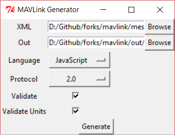
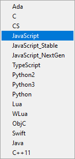

# Generating MAVLink Libraries

Language-specific MAVLink libraries can be created from [XML Message Definitions](../messages/README.md) using _code generator_ tools.

This page shows how to use the following two code generators provided with the MAVLink project:

- GUI tool: [mavgenerate](#mavgenerate)
- Command line tool: [mavgen](#mavgen), which is the backend tool used also by mavgenerate

> **Note** These generators can build MAVLink 2 and MAVLink 1 libraries for the following programming languages: C, C++11, Python, Typescript, Java, and WLua. The following programming languages are supported for MAVLink 1 libraries only: C#, JavaScript, ObjC, Swift.

<span></span>

> **Tip** Generators for other programming languages are supported and documented in independent projects.
> For more information see [Supported Languages](../README.md#supported_languages).

## Pre-requisites

1. You must already have [Installed the MAVLink toolchain](../getting_started/installation.md), which includes the mavgenerate and mavgen tools used below as well as the [XML Message Definitions](../messages/README.md).
1. If you are generating messages for a [custom dialect](../messages/README.md#dialects), copy the dialect [XML definition file(s)](../messages/README.md#xml-definition-files--dialects) into the directory [message_definitions/v1.0/](https://github.com/mavlink/mavlink/tree/master/message_definitions/v1.0).
   > **Note** _mavgen_ can handle dialects that have relative paths for included XML files (e.g typically [common.xml](../messages/common.md)), but other generators may not.
   > We recommend putting custom dialects in the same folder as the ones that come with the [mavlink/mavlink](https://github.com/mavlink/mavlink) repository.

## Building MAVLink libraries using the Mavgenerate GUI {#mavgenerate}

**mavgenerate.py** is GUI code generator for MAVLink, written in Python.

> **Note** _Mavgenerate_ provides a GUI front end to the [mavgen](#mavgen) command line code generator, and supports the same [options](#mavgen_options).

The GUI can be launched from anywhere using Python's `-m` argument:

```sh
python3 -m mavgenerate
```



Steps for generating the MAVLink library code:

1. Choose the target XML file (typically in [mavlink/message_definitions/1.0](https://github.com/mavlink/mavlink/tree/master/message_definitions/v1.0)).

   > **Note** If using a custom dialect, first copy it into the above directory (if the dialect is dependent on **common.xml** it must be located in the same directory).

1. Choose an output directory (e.g. **mavlink/include**).
1. Select the target output programming language.

   

   For JavaScript in particular there are three options:

   - `JavaScript_Stable` is an older version that only supports MAVLink 1.0,
   - `JavaScript_NextGen` is a more recent version that supports MAVLink 1 and 2 along with signing.
   - `JavaScript` is a "proxy" for the recommended version. Currently this is `JavaScript_Stable`.

1. Select the target MAVLink protocol version. Ideally use 2.0 if the generator supports it.

   > **Caution** Generation will fail if the protocol is not [supported](../README.md#supported_languages) by the selected programming language.

1. Optionally check _Validate_ and/or _Validate Units_, which validates XML specifications.

1. Click **Generate** to create the source files for the MAVLink library and the chosen dialect.

## Building MAVLink libraries using the Mavgen Command Line Tool {#mavgen}

**mavgen.py** is a command line tool for generating MAVLink libraries for various programming languages.
You can run mavgen from the `mavlink` directory. However, if you are outside of the mavlink directory, you need to add the `mavlink` directory to the `PYTHONPATH` environment variable.

> **Tip** Mavgen is the backend used by [mavgenerate](#mavgenerate). The documentation below explains all the options for both tools.

Below is an example for how to generate _MAVLink 2_ libraries for the C programming language using a dialect named **your_custom_dialect.xml**:

```sh
python3 -m pymavlink.tools.mavgen --lang=C --wire-protocol=2.0 --output=generated/include/mavlink/v2.0 message_definitions/v1.0/your_custom_dialect.xml
```

> **Note** The syntax for for generating Python modules is the same, except that the `--output` specifies a _filename_ rather than a directory.

  <!-- https://github.com/ArduPilot/pymavlink/issues/203 -->

<span id="mavgen_options"></span>
The full syntax and options can be output by running `mavgen.py -h` flag, which is reproduced below:

```
usage: mavgen.py [-h] [-o OUTPUT] [--lang {Ada,C,CS,JavaScript,JavaScript_Stable,JavaScript_NextGen,TypeScript,Python2,Python3,Python,Lua,WLua,ObjC,Swift,Java,C++11}]
                 [--wire-protocol {0.9,1.0,2.0}] [--no-validate] [--error-limit ERROR_LIMIT] [--strict-units]
                 XML [XML ...]

This tool generate implementations from MAVLink message definitions

positional arguments:
  XML                   MAVLink definitions

options:
  -h, --help            show this help message and exit
  -o OUTPUT, --output OUTPUT
                        output directory.
  --lang {Ada,C,CS,JavaScript,JavaScript_Stable,JavaScript_NextGen,TypeScript,Python2,Python3,Python,Lua,WLua,ObjC,Swift,Java,C++11}
                        language of generated code [default: Python]
  --wire-protocol {0.9,1.0,2.0}
                        MAVLink protocol version. [default: 1.0]
  --no-validate         Do not perform XML validation. Can speed up code generation if XML files are known to be correct.
  --error-limit ERROR_LIMIT
                        maximum number of validation errors to display
  --strict-units        Perform validation of units attributes.
```
