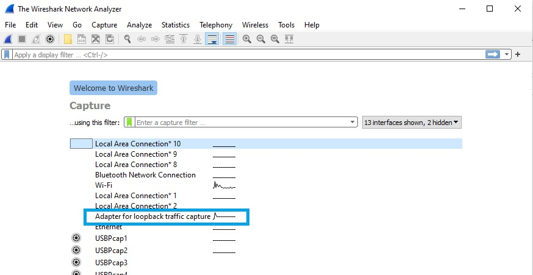
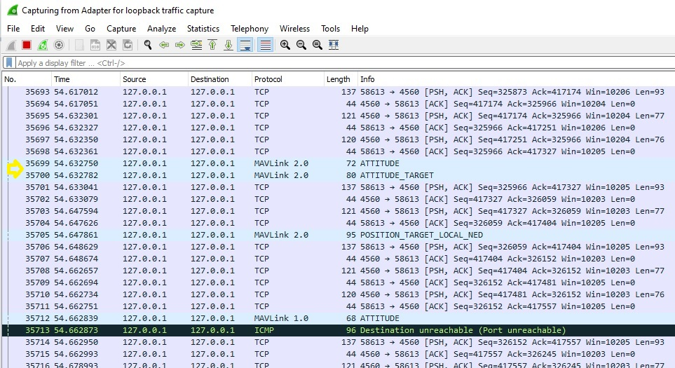
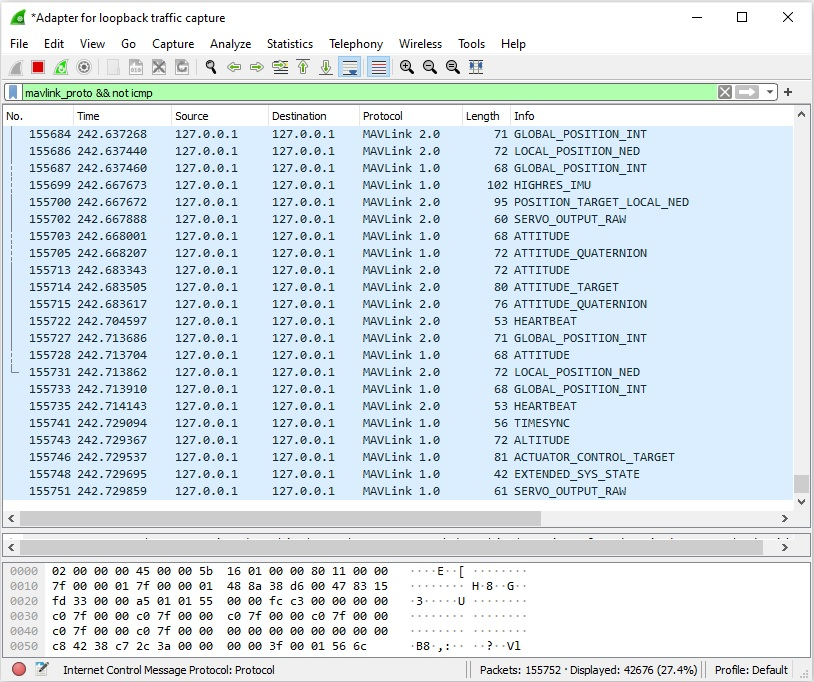
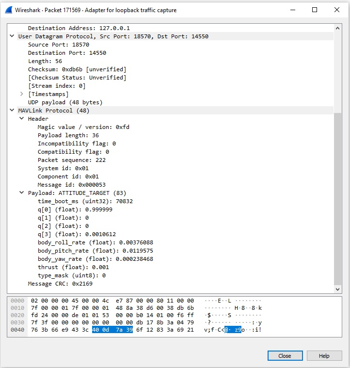

# Parsing MAVLink in Wireshark

[Wireshark](https://www.wireshark.org/) is an extremely popular "general purpose" network protocol analyzer that can be used to inspect and analyse MAVLink traffic.

The benefits of using *Wireshark* over other alternatives are:
- it can view _all_ traffic on a network interface (GCS tools like [MAVLink Inspector](https://docs.qgroundcontrol.com/master/en/analyze_view/mavlink_inspector.html) often only analyse incoming traffic).
- you can use it to analyse traffic logged on a companion computer (this allows analysis of traffic between the companion computer and flight controller, which might otherwise not be visible to *Wireshark*).
-  it is easy to update for new custom messages and dialects. 
   Rebuilding *QGroundControl* so you can use it analyse custom messages is much harder!

This topic shows how to generate a Wireshark plugin for a particular dialect file and install it on Wireshark, and how to perform basic filtering.
It also provides an overview of how you can use *tcpdump* for collecting traffic on a linux computer (for later analysis).

> **Note** You will need to regenerate and reimport the plugin (as shown below) if your dialect changes.


## Generate MAVLink Lua Plugin for Wireshark

First you will need to generate a *Wireshark* plugin that includes definitions for the MAVLink messages that you want it to handle.
The MAVLink generator (**mavgen**) can build this plugin for a dialect in the same way as it builds MAVLink libraries for other programming languages.

The steps are:
1. [Install MAVLink](../getting_started/installation.md) (if you have not already done so).
1. Build libraries for your target dialect, specifing `WLua` as the target language.
   This process is described in the topic [Generate MAVLink Libraries](../getting_started/generate_libraries.md).

   For example, to build the MAVLink 2 Wireshark plugin for [common.xml](../messages/common.md) you might use the following command:
   ```bash
   python3 -m pymavlink.tools.mavgen --lang=WLua --wire-protocol=2.0 --output=mavlink_2_common message_definitions/v1.0/common.xml
   ```
   The plugin would be created in the current directory as: **mavlink_2_common.lua**. 


## Update Plugin with Correct Ports

The last few lines of the plugin file specify the ports to be monitored.

```
-- bind protocol dissector to port 14550 and 14580

local udp_dissector_table = DissectorTable.get("udp.port")
udp_dissector_table:add(14550, mavlink_proto)
udp_dissector_table:add(14580, mavlink_proto)
udp_dissector_table:add(18570, mavlink_proto)
```

These first two ports are the correct ports to monitor network traffic between a simulated autopilot and a GCS and offboard API.
The final port (18570) can be used to monitor a simulation running in WSL2.

If you want to monitor other interfaces then you can modify or add to these lines and then save the plugin file.
This might be necessary, for example, in order to monitor traffic recorded on the interface between a companion computer and a flight controller.


## Import Lua Plugin into WireShark

To import the plugin into *Wireshark*:

1. Copy the plugin file into the wireshare plugins directory.
   - On Linux systems this might be: `~/.local/lib/wireshark/plugins` (or `~/.wireshark/plugins` for older versions of Wireshark).
     Note that users will need to be added to the `wireshark` group to use the tool.)
   - On Windows this might be: `Program Files/Wireshark/plugins`.
1. Open *Wireshark* and follow the menu: **Help > About Wireshark > Plugins**

   You should find the plugin in the list.
   For example, with the plugin created in the previous section you would see `mavlink_2_common.lua` 

## View Traffic on Wireshark

Wireshark can inspect any interface on the host computer on which it is running.
So you can use it to inspect traffic between a GCS and running on the same computer and a real or simulated computer.

For example assuming you have a simulator and ground station running on the same computer, select the **Adapter for loopback traffic capture**.



This will display all traffic on the interface.
With the MAVLink WLua plugin installed, MAVLink message names are displayed next to each UDP packet that contains a MAVLink message.



You can filter to show _just_ the MAVLink traffic using `mavlink_proto` in the filter box (below we also filter on `not icmp` to remove additional control packets).



Click on a particular message to find out its details.
Below you can see the payload and the header details for an `ATTITUDE_TARGET` message:




## Filtering using MAVLink Properties

In addition to using filters for the usual *Wireshark* things (e.g. ips and ports) you can also use the new MAVLink filters.

> **Note** This works the same way for live view and for a *pcapng* file loaded into *Wireshark*

We already saw you can filter for MAVLink packets using `mavlink_proto`.
The following is a filter example:

```
mavlink_proto.msgid==0 && mavlink_proto.compid == 1 && 
(ip.addr == 10.0.115.155 && ip.dst == 10.0.115.141)
```

This means to filter for:

- Mavlink msgid=`HEARTBEAT`
- Mavlink src compid=`AUTOPILOT`
- src IP=`10.0.115.155`
- dst IP=`10.0.115.141`


## Capture MAVLink Stream

On Linux you can use *tcpdump* to capture stream on a specific interface.
This can be performed either on your laptop or on the offboard computer:

```
apt update
apt install tcpdump
tcpdump -i eth0 -w mavlink-capture.pcap
```


## Capture tcpdump (MAVLink) data live from a remote machine on a local WireShark

`tcpdump` must be installed on the remote machine.

When you can access the remote machine with SSH you can stream the tcpdump to your local machine instead of logging it to a file.
*Wireshark* can open this stream and show the decoded MAVLink messages using the tools and filters from above.

```
mkfifo /tmp/mavlink;
wireshark -k -i /tmp/mavlink &
ssh root@10.41.1.1 -p 33333 "tcpdump -s 0 -U -n -w - -i lo not port 33333" > /tmp/mavlink;
```

> **Note** Username, IP and port above have to be adjusted to the configuration on the remote machine.

1. `mkfifo /tmp/mavlink` Creates a named pipe that is used to stream the data.
1. `wireshark -k -i /tmp/mavlink &` Start *Wireshark*, open the named pipe as input and start the capture immediately. 
1. Start the data stream on the remote machine and pipe it into the named pipe on your local machine.

   - `-s 0` Set snapshot length to default
   - `-U` Stream packet output packet-buffered, don’t wait for a full buffer
   - `-n` Don't convert addresses (i.e., host addresses, port numbers, etc.) to names
   - `-w -` Write raw data to standard output (piped to the local machine)
   - `-i lo` Define which interface to listen on.
     This will listen to the loopback interface, you can change this to the Ethernet, USB or modem interface.
   - `not port 33333` Don’t capture the data created by the SSH session.
     You can add more filters to tcpdump to reduce the streamed data.

## Measuring MAVLink data rates using Wireshark

After the plugin is setup in Wireshark ad you have started to capture a stream you can use the Wireshark IO graphsto  monitor message rates for either the whole stream or just specific messages.

To do this you need to go to **Statistics > I/O Graphs** and you will get a new window.
Now you will a plot of the data rate of all packets you are analyzing.
You can filter for the usual *Wireshark* filters and the new MAVLink ones introduced by the LUA script.

We recommend changing the y axis to bits or bytes and to reduce the x axis to 10ms or faster to get meaningful plots.
