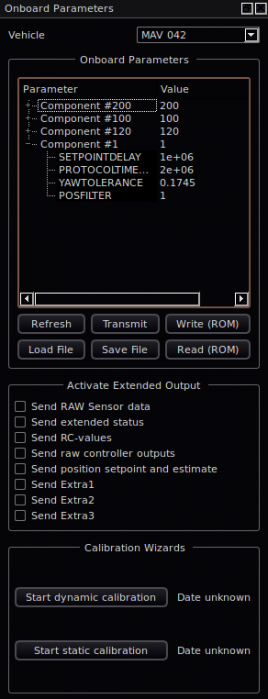

# Parameter Protocol

> **Caution** This content has not been reviewed since being ported from the old website (and may be out of date). Updates/re-validation welcome!

The parameter protocol is used to exchange key system settings and guarantees delivery.

The onboard parameter interface allows to read and write parameters (e.g. PID gains) into the current memory (RAM) and also into permanent storage.

It can be both implemented on a microcontroller (e.g. the pxIMU with ARM7) and in standard software (e.g. px_multitracker process in Linux).

## Supported Data Types

MAVLink v1.0 supports these data types:

* `uint32_t` - 32bit unsigned integer (use the ENUM value [MAV_PARAM_TYPE_UINT32](../messages/common.md#MAV_PARAM_TYPE_UINT32))
* `int32_t` - 32bit signed integer (use the ENUM value [MAV_PARAM_TYPE_INT32](../messages/common.md#MAV_PARAM_TYPE_INT32))
* `float` - IEEE754 single precision floating point number (use the ENUM value [MAV_PARAM_TYPE_FLOAT](../messages/common.md#MAV_PARAM_TYPE_FLOAT))

> **Note** All parameters are send as the float value of `mavlink_param_union_t`, which means that a parameter should be byte-wise converted with this union to a byte-wise float (no type conversion). This is necessary in order to not limit the maximum precision for scaled integer params. E.g. GPS coordinates can only be expressed with single float precision up to a few meters, while GPS coordinates in 1E7 scaled integers provide very high accuracy.

```c
mavlink_param_union_t param;

int32_t integer = 20000;

param.param_int32 = integer;
param.type = MAV_PARAM_TYPE_INT32;

// Then send the param by providing the float bytes to the send function
mavlink_msg_param_set_send(xx, xx, param.param_float, param.type, xx);
```

## Multi-System and Multi-Component Support

MAVLink supports multiple systems / airplanes in parallel on the same link. In addition to this, it also supports multiple MAVLink-enabled devices in the same airplane. The protocol for example allows to communicate over one radio link with the autopilot and a payload unit. For this reason the parameter protocol also differentiates between components. To get a complete parameter list from a system, send the request parameter message with `target_component` set to 0 (enum value: [MAV_COMP_ID_ALL](../messages/common.md#MAV_COMP_ID_ALL)). All onboard components should respond to parameter request messages with their ID or with ID `MAV_COMP_ID_ALL` (0). QGroundControl by default queries all components of a system (it only queries the currently selected system, not all systems) and therefore sends ID 0 / `MAV_COMP_ID_ALL`.


## Graphical User Interface in QGroundControl

For this reason the parameter interface *discriminates between systems (one system is one airplane) and components (one component is one entity in the architecture, e.g. the IMU or a Linux process).* This allows to transparently access the individual component parameters without the need of a central onboard unit that translates the parameter read/write requests for the onboard components.

As can be seen on the image below, each component is represented by a top-level node in the parameter tree. The system (the MAV) can be selected in the top-level drop-down menu. The GUI keeps track of changed parameters will send those parameters which changed to the appropriate components.



To facilitate the use of many parameters, the tree is structures at the top level according to the first underscore ("_") in the parameter name. So `PID_POS_X_P` and `PID_POS_Y_P` will be grouped below the `PID` node.


## Communication / State Machine

The onboard parameters are identified by a 14-char string and store a floating point (IEE 754 single-precision, 4 bytes) value. This key->value pair has many important properties:

* The human-readable name is very helpful for users, yet it is still small enough
* The GCS does not have to know in advance what onboard parameters exist
* Support for unknown autopilots, as long as they implement the protocol, is guaranteed
* Addind a parameter is only a change to the onboard code.

### Read Parameters

Reading the parameter list is activated by sending the [PARAM_REQUEST_LIST](../messages/common.md#PARAM_REQUEST_LIST) message. The onboard component should start to transmit the parameters individually after receiving this message. The sending should be delayed after each parameter, in order to not use up the full radio bandwidth.


sequenceDiagram;
    participant GCS
    participant Drone
    GCS->>Drone: PARAM_REQUEST_LIST
    Drone->>Drone: Start sending parameters
    Drone->>GCS: Send N parameters
    GCS->>GCS: Start receive timeout
    GCS->>Drone: Request dropped params with PARAM_REQUEST_READ


### Read Single Parameter

A single parameter can be read by the [PARAM_REQUEST_READ](../messages/common.md#PARAM_REQUEST_READ) message.


### Write Parameters

As *QGroundControl* does not have its own list of the parameters on startup, before writing a parameter first the parameter list has to be read once. After that, parameters can be written individually by sending the key->value pair to the component. As QGroundControl keeps track of changed parameters, clicking the write button will only transmit those which have changed in value. The MAV **has to acknowledge the write operation** by emitting a [PARAM_REQUEST_READ](../messages/common.md#PARAM_VALUE)  value message with the newly written parameter value.


sequenceDiagram;
    participant GCS
    participant Drone
    GCS->>Drone: Semd parameter name and value
    GCS->>GCS: Start timeout for receiving update value/ACK
    Drone->>GCS: Send updated values
    GCS->>Drone: If loss occurs: restart write transmission.


## Onboard Permanent Storage

The parameter interface offers two buttons to load the parameters onboard from the permanent onboard storage into RAM and to save the current parameters in RAM to permanent storage. To write a new value from QGroundControl to permanent storage, first the value has to be transmitted and afterwards the write to ROM command has to be issued.

## QGroundControl Parameter Files

QGroundControl allows to save the current values of the onboard parameters in a text file. The file can then be again imported and transmitted to the MAV. This allows to e.g. configure several vehicles completely similar with safe default values.

## Developers

For implementing this interface onboard or if you like to extend the QGroundControl implementation, please find additional references below:

 
* <del>[QgroundControl Parameter Interface API documentation](http://pixhawk.ethz.ch/api/qgroundcontrol/classQGCParamWidget.html)</del>
* [[:mavlink/|MAVLink reference and documentation]]
* </del>[MAVLink API documentation](http://pixhawk.ethz.ch/api/mavlink/)</del>


### MCU
This MCU implementation is taken from the PIXHAWK IMU/Autopilot codebase. It allows to store onboard parameters. *Please note that this code might not compile right away, you first need to adjust it to your onboard data structures.*

```c
#define ONBOARD_PARAM_COUNT 5

struct global_struct
{
	float param[ONBOARD_PARAM_COUNT];
	char param_name[ONBOARD_PARAM_COUNT][MAVLINK_MSG_PARAM_SET_FIELD_PARAM_ID_LEN];
};

struct global_struct global_data;


/**
 * @brief reset all parameters to default
 * @warning DO NOT USE THIS IN FLIGHT!
 */
static inline void global_data_reset_param_defaults(void)
{
	global_data.param[PARAM_SYSTEM_ID] = 42;
	strcpy(global_data.param_name[PARAM_SYSTEM_ID], "SYS_ID");
}

uint16_t m_parameter_i = 0;

static void handle_mavlink_message(mavlink_channel_t chan,
		mavlink_message_t* msg)
{
	uint8_t buf[MAVLINK_MAX_PACKET_LEN];
	uint32_t len;
	switch (chan)
	{
	case MAVLINK_MSG_ID_PARAM_REQUEST_LIST:
	{
		// Start sending parameters
		m_parameter_i = 0;
	}
	break;
case MAVLINK_MSG_ID_PARAM_SET:
	{
		mavlink_param_set_t set;
		mavlink_msg_param_set_decode(msg, &set);

		// Check if this message is for this system
		if ((uint8_t) set.target_system
				== (uint8_t) global_data.param[PARAM_SYSTEM_ID]
				                               && (uint8_t) set.target_component
				                               == (uint8_t) global_data.param[PARAM_COMPONENT_ID])
		{
			char* key = (char*) set.param_id;

			for (uint16_t i = 0; i < ONBOARD_PARAM_COUNT; i++)
			{
				bool match = true;
				for (uint16_t j = 0; j < ONBOARD_PARAM_NAME_LENGTH; j++)
				{
					// Compare
					if (((char) (global_data.param_name[i][j]))
							!= (char) (key[j]))
					{
						match = false;
					}

					// End matching if null termination is reached
					if (((char) global_data.param_name[i][j]) == '\0')
					{
						break;
					}
				}

				// Check if matched
				if (match)
				{
					// Only write and emit changes if there is actually a difference
					// AND only write if new value is NOT "not-a-number"
					// AND is NOT infinity
					if (global_data.param[i] != set.param_value
							&& !isnan(set.param_value)
							&& !isinf(set.param_value) && set.param_type == MAVLINK_TYPE_FLOAT)
					{
						global_data.param[i] = set.param_value;
						// Report back new value
                                                mavlink_msg_param_value_send(MAVLINK_COMM_0,
								(int8_t*) global_data.param_name[i],
								global_data.param[i], MAVLINK_TYPE_FLOAT, 
                                                               ONBOARD_PARAM_COUNT, m_parameter_i);
					}
				}
			}
		}
	}
	break;
}

/**
* @brief Send low-priority messages at a maximum rate of xx Hertz
*
* This function sends messages at a lower rate to not exceed the wireless
* bandwidth. It sends one message each time it is called until the buffer is empty.
* Call this function with xx Hertz to increase/decrease the bandwidth.
*/
static void communication_queued_send(void)
{
	//send parameters one by one
	if (m_parameter_i < ONBOARD_PARAM_COUNT)
	{

		mavlink_msg_param_value_send(MAVLINK_COMM_0,
					    (int8_t*) global_data.param_name[m_parameter_i],
				         global_data.param[m_parameter_i], MAVLINK_TYPE_FLOAT,
                                         ONBOARD_PARAM_COUNT, m_parameter_i);
		m_parameter_i++;
	}
}

/**
* @brief This is the main loop
*
* It will be executed at maximum MCU speed (xx MHz)
*/
void main_loop(void)
{
	// Load default eeprom parameters as fallback
	global_data_reset_param_defaults();

  while (1)
  {
    msleep(100); // Use any wait or periodec check function you want, better not use sleep
    
    mavlink_message_t msg;
    mavlink_status_t status;
    if(mavlink_parse_char(MAVLINK_COMM_0, uart0_get_char(), &msg, &status))
    {
       // See onboard integration tutorial
       handle_mavlink_message(MAVLINK_COMM_0, &msg); // If a parameter request occured,
                                                     // it will be processed
    }
    
    communication_queued_send(void); // Send parameters at 10 Hz, if previously requested
  }
}
```