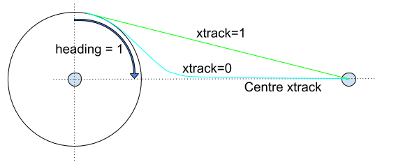
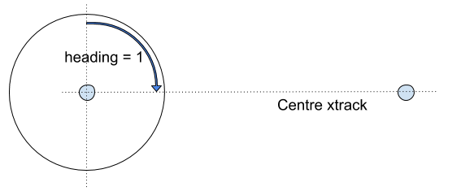
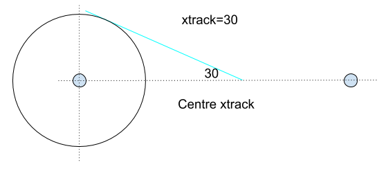

# Mission Protocol

The mission sub-protocol allows a GCS or developer API to exchange *mission* (flight plan), *geofence* and *safe point* information with a drone/component.

The protocol covers:
- Operations to upload, download and clear missions, set/get the current mission item number, and get notification when the current mission item has changed.
- Message type(s) and enumerations for exchanging mission items.
- Mission Items ("MAVLink commands") that are common to most systems.

The protocol supports re-request of messages that have not arrived, which allows missions to be reliably transferred over a lossy link.

## Mission Types {#mission_types}

MAVLink 2 supports three types of "missions": flight plans, geofences and rally/safe points.
The protocol uses the same sequence of operations for all types (albeit with different types of [Mission Items](#mavlink_commands)).
The mission types must be stored and handled separately/independently.

Mission protocol messages include the type of associated mission in the `mission_type` field (a MAVLink 2 message extension).
The field takes one of the [MAV_MISSION_TYPE](../messages/common.md#MAV_MISSION_TYPE) enum values:
[MAV_MISSION_TYPE_MISSION](../messages/common.md#MAV_MISSION_TYPE_MISSION), [MAV_MISSION_TYPE_FENCE](../messages/common.md#MAV_MISSION_TYPE_FENCE), [MAV_MISSION_TYPE_RALLY](../messages/common.md#MAV_MISSION_TYPE_RALLY).

> **Note** MAVLink 1 supports only "regular" flight-plan missions (this is implied/not explicitly set).

## Mission Items (MAVLink Commands) {#mavlink_commands}

Mission items for all the [mission types](#mission_types) are defined in the [MAV_CMD](../messages/common.md#MAV_CMD) enum.

> **Note** [MAV_CMD](../messages/common.md#MAV_CMD) is used to define commands that can be used in missions ("mission items") and commands that can be sent outside of a mission context (using the [Command Protocol](../services/command.md)). 
  Some `MAV_CMD` can be used with both mission and command protocols.
  Not all commands/mission items are supported on all systems (or for all flight modes).

The items for the different types of mission are identified using a simple name prefix convention:
- *Flight plans*:
  - NAV commands (`MAV_CMD_NAV_*`) for navigation/movement (e.g. [MAV_CMD_NAV_WAYPOINT](../messages/common.md#MAV_CMD_NAV_WAYPOINT), [MAV_CMD_NAV_LAND](../messages/common.md#MAV_CMD_NAV_LAND))
  - DO commands (`MAV_CMD_DO_*`) for immediate actions like changing speed or activating a servo (e.g. [MAV_CMD_DO_CHANGE_SPEED](../messages/common.md#MAV_CMD_DO_CHANGE_SPEED)).
  - CONDITION commands (`MAV_CMD_CONDITION_*`) for changing the execution of the mission based on a condition - e.g. pausing the mission for a time before executing next command ([MAV_CMD_CONDITION_DELAY](../messages/common.md#MAV_CMD_CONDITION_DELAY)).
- *Geofence mission items*:
  - Prefixed with `MAV_CMD_NAV_FENCE_` (e.g. [MAV_CMD_NAV_FENCE_RETURN_POINT](../messages/common.md#MAV_CMD_NAV_FENCE_RETURN_POINT)).
- *Rally point mission items*: 
  - There is just one rally point `MAV_CMD`: [MAV_CMD_NAV_RALLY_POINT](../messages/common.md#MAV_CMD_NAV_RALLY_POINT).

The commands are transmitted/encoded in [MISSION_ITEM or MISSION_ITEM_INT](#command_message_type) messages.
These messages include fields to identify the particular mission item (command id) and up to 7 command-specific optional parameters.

Field Name | Type | Values | Description
--- | --- | --- | ---
command | uint16_t | [MAV_CMD](../messages/common.md#MAV_CMD) | Command id, as defined in [MAV_CMD](../messages/common.md#MAV_CMD).
param1 | float |  | Param #1.
param2 | float |  | Param #2.
param3 | float |  | Param #3.
param4 | float |  | Param #4.
param5 (x) | float / int32_t | | X coordinate (local frame) or latitude (global frame) for navigation commands (otherwise Param #5).
param6 (y) | float / int32_t | | Y coordinate (local frame) or longitude (global frame) for navigation commands (otherwise Param #6).
param7 (z) | float | | Z coordinate (local frame) or altitude (global - relative or absolute, depending on frame) (otherwise Param #7).

The first four parameters (shown above) can be used for any purpose - this depends on the particular [command](../messages/common.md#MAV_CMD). 
The last three parameters (x, y, z) are used for positional information in `MAV_CMD_NAV_*` commands, but can be used for any purpose in other commands.

The remaining message fields are used for addressing, defining the mission type, specifying the reference frame used for x, y, z in `MAV_CMD_NAV_*` messages, etc.:

Field Name | Type | Values | Description
--- | --- | --- | ---
target_system | uint8_t | | System ID
target_component | uint8_t | | Component ID
seq | uint16_t |  | Sequence number for item within mission (indexed from 0).
frame | uint8_t | MAV_FRAME | The coordinate system of the waypoint. ArduPilot and PX4 both only support global frames in MAVLink commands (local frames may be supported if the same command is sent via the command protocol).
mission_type | uint8_t | MAV_MISSION_TYPE | [Mission type](#mission_types).
current | uint8_t | false:0, true:1 | When downloading, whether the item is the current mission item.
autocontinue | uint8_t | | Autocontinue to next waypoint when the command completes.

## MISSION_ITEM_INT vs MISSION_ITEM {#command_message_type}

[MISSION_ITEM](../messages/common.md#MISSION_ITEM) and [MISSION_ITEM_INT](../messages/common.md#MISSION_ITEM_INT) are used to exchange individual [mission items](#message_commands) between systems. `MISSION_ITEM` messages encode all mission item parameters into `float` parameters fields (single precision IEEE754) for transmission. `MISSION_ITEM_INT` is exactly the same except that `param5` and `param6` are Int32 fields.

Protocol implementations must allow both message types in supported [operations](#operations) (along with the  corresponding [MISSION_REQUEST](../messages/common.md#MISSION_REQUEST) and [MISSION_REQUEST_INT](../messages/common.md#MISSION_REQUEST_INT) message types).

MAVLink *users* should always prefer `MISSION_ITEM_INT` because it allows latitude/longitude to be encoded without the loss of precision that can come from using `MISSION_ITEM`.

## Message/Enum Summary

The following messages and enums are used by the service.

Message | Description
-- | --
[MISSION_REQUEST_LIST](../messages/common.md#MISSION_REQUEST_LIST) | Initiate [mission download](#download_mission) from a system by requesting the list of mission items.
[MISSION_COUNT](../messages/common.md#MISSION_COUNT) | Send the number of items in a mission. This is used to initiate [mission upload](#uploading_mission) or as a response to [MISSION_REQUEST_LIST](#MISSION_REQUEST_LIST) when [downloading a mission](#download_mission).
[MISSION_REQUEST_INT](../messages/common.md#MISSION_REQUEST_INT) | Request mission item data for a specific sequence number be sent by the recipient using a [MISSION_ITEM_INT](#MISSION_ITEM_INT) message. Used for mission [upload](#uploading_mission) and [download](#download_mission).
[MISSION_REQUEST](../messages/common.md#MISSION_REQUEST) | Request mission item data for a specific sequence number be sent by the recipient using a [MISSION_ITEM](#MISSION_ITEM) message. Used for mission [upload](#uploading_mission) and [download](#download_mission).
[MISSION_ITEM_INT](../messages/common.md#MISSION_ITEM_INT) | Message encoding a [mission item/command](#mavlink_commands) (defined in a [MAV_CMD](#MAV_CMD)). The message encodes positional information in integer parameters for greater precision than [MISSION_ITEM](#MISSION_ITEM). Used for mission [upload](#uploading_mission) and [download](#download_mission).
[MISSION_ITEM](../messages/common.md#MISSION_ITEM) | Message encoding a [mission item/command](#mavlink_commands) (defined in a [MAV_CMD](#MAV_CMD)). The message encodes positional information in `float` parameters. Used for mission [upload](#uploading_mission) and [download](#download_mission).
[MISSION_ACK](../messages/common.md#MISSION_ACK) | Acknowledgment message when a system completes a [mission operation](#operations) (e.g. sent by autopilot after it has uploaded all mission items). The message includes a [MAV_MISSION_RESULT](#MAV_MISSION_RESULT) indicating either success or the type of failure.
[MISSION_CURRENT](../messages/common.md#MISSION_CURRENT) | Message containing the current mission item sequence number. This is emitted when the [current mission item is set/changed](#current_mission_item).
[MISSION_SET_CURRENT](../messages/common.md#MISSION_SET_CURRENT) | [Set the current mission item](#current_mission_item) by sequence number (continue to this item on the shortest path).
[STATUSTEXT](../messages/common.md#STATUSTEXT) | Sent to notify systems when a request to [set the current mission item](#current_mission_item) fails.
[MISSION_CLEAR_ALL](../messages/common.md#MISSION_CLEAR_ALL) | Message sent to [clear/delete all mission items](#clear_mission) stored on a system.
[MISSION_ITEM_REACHED](../messages/common.md#MISSION_ITEM_REACHED) | Message emitted by system whenever it reaches a new waypoint. Used to [monitor progress](#monitor_progress).

Enum | Description
-- | --
[MAV_MISSION_TYPE](../messages/common.md#MAV_MISSION_TYPE) | [Mission type](#mission_types) for message (mission, geofence, rallypoints).
[MAV_MISSION_RESULT](../messages/common.md#MAV_MISSION_RESULT) | Used to indicate the success or failure reason for an operation (e.g. to upload or download a mission). This is carried in a [MISSION_ACK](#MISSION_ACK).
[MAV_FRAME](../messages/common.md#MAV_FRAME) | Co-ordinate frame for position/velocity/acceleration data in the message.
[MAV_CMD](../messages/common.md#MAV_CMD) | [Mission Items](#mavlink_commands) (and MAVLink commands). These can be sent in [MISSION_ITEM](#MISSION_ITEM) or [MISSION_ITEM_INT](#MISSION_ITEM_INT).

## Operations {#operations}

This section defines all the protocol operations.

### Upload a Mission to the Vehicle {#uploading_mission}

The diagram below shows the communication sequence to upload a mission to a drone (assuming all operations succeed).

> **Note** Mission update must be robust! 
  A new mission should be fully uploaded and accepted before the old mission is replaced/removed.

[](https://mermaid-js.github.io/mermaid-live-editor/#/edit/eyJjb2RlIjoic2VxdWVuY2VEaWFncmFtO1xuICAgIHBhcnRpY2lwYW50IEdDU1xuICAgIHBhcnRpY2lwYW50IERyb25lXG4gICAgR0NTLT4-RHJvbmU6IE1JU1NJT05fQ09VTlRcbiAgICBHQ1MtPj5HQ1M6IFN0YXJ0IHRpbWVvdXRcbiAgICBEcm9uZS0-PkdDUzogTUlTU0lPTl9SRVFVRVNUX0lOVCAoMClcbiAgICBEcm9uZS0-PkRyb25lOiBTdGFydCB0aW1lb3V0XG4gICAgR0NTLS0-PkRyb25lOiBNSVNTSU9OX0lURU1fSU5UICgwKVxuICAgIE5vdGUgb3ZlciBHQ1MsRHJvbmU6IC4uLiBpdGVyYXRlIHRocm91Z2ggaXRlbXMgLi4uXG4gICAgRHJvbmUtPj5HQ1M6IE1JU1NJT05fUkVRVUVTVF9JTlQgKGNvdW50LTEpXG4gICAgRHJvbmUtPj5Ecm9uZTogU3RhcnQgdGltZW91dFxuICAgIEdDUy0tPj5Ecm9uZTogTUlTU0lPTl9JVEVNX0lOVCAoY291bnQtMSlcbiAgICBEcm9uZS0-PkdDUzogTUlTU0lPTl9BQ0siLCJtZXJtYWlkIjp7InRoZW1lIjoiZGVmYXVsdCJ9LCJ1cGRhdGVFZGl0b3IiOmZhbHNlfQ)

<!-- Original sequence diagram
sequenceDiagram;
    participant GCS
    participant Drone
    GCS->>Drone: MISSION_COUNT
    GCS->>GCS: Start timeout
    Drone->>GCS: MISSION_REQUEST_INT (0)
    Drone->>Drone: Start timeout
    GCS-- >>Drone: MISSION_ITEM_INT (0)
    Note over GCS,Drone: ... iterate through items ...
    Drone->>GCS: MISSION_REQUEST_INT (count-1)
    Drone->>Drone: Start timeout
    GCS-- >>Drone: MISSION_ITEM_INT (count-1)
    Drone->>GCS: MISSION_ACK
-->

In more detail, the sequence of operations is:
1. GCS sends [MISSION_COUNT](../messages/common.md#MISSION_COUNT) including the number of mission items to be uploaded (`count`).
   - A [timeout](#timeout) must be started for the GCS to wait on the response from Drone (`MISSION_REQUEST_INT`).
1. Drone receives message and responds with [MISSION_REQUEST_INT](../messages/common.md#MISSION_REQUEST_INT) requesting the first mission item (`seq==0`).
   - A [timeout](#timeout) must be started for the Drone to wait on the `MISSION_ITEM_INT` response from GCS.
1. GCS receives `MISSION_REQUEST_INT` and responds with the requested mission item in a [MISSION_ITEM_INT](../messages/common.md#MISSION_ITEM_INT) message.
1. Drone and GCS repeat the `MISSION_REQUEST_INT`/`MISSION_ITEM_INT` cycle, iterating `seq` until all items are uploaded (`seq==count-1`).
1. After receiving the last mission item the drone responds with [MISSION_ACK](../messages/common.md#MISSION_ACK) with the `type` of [MAV_MISSION_ACCEPTED](../messages/common.md#MAV_MISSION_ACCEPTED) indicating mission upload completion/success.
   - The drone should set the new mission to be the current mission, discarding the original data.
   - The drone considers the upload complete.
1. GCS receives `MISSION_ACK` containing `MAV_MISSION_ACCEPTED` to indicate the operation is complete.

Note:
- A [timeout](#timeout) is set for every message that requires a response (e.g. `MISSION_REQUEST_INT`).
  If the timeout expires without a response being received then the request must be resent.
- Mission items must be received in order.
  If an item is received out-of-sequence the expected item should be re-requested by the vehicle (the out-of-sequence item is dropped).
- An [error](#errors) can be signaled in response to any request using a [MISSION_ACK](../messages/common.md#MISSION_ACK) message containing an error code. 
  This must cancel the operation and restore the mission to its previous state.
  For example, the drone might respond to the [MISSION_COUNT](../messages/common.md#MISSION_COUNT) request with a [MAV_MISSION_NO_SPACE](../messages/common.md#MAV_MISSION_NO_SPACE) if there isn't enough space to upload the mission.
- The sequence above shows the [mission items](#mavlink_commands) packaged in [MISSION_ITEM_INT](../messages/common.md#MISSION_ITEM_INT) messages. 
  Protocol implementations must also support [MISSION_ITEM](../messages/common.md#MISSION_ITEM) and [MISSION_REQUEST](../messages/common.md#MISSION_REQUEST) in the same way.
- Uploading an empty mission ([MISSION_COUNT](../messages/common.md#MISSION_COUNT) is 0) has the same effect as [clearing the mission](#clear_mission).

### Download a Mission from the Vehicle {#download_mission}

The diagram below shows the communication sequence to download a mission from a drone (assuming all operations succeed).

[](https://mermaid-js.github.io/mermaid-live-editor/#/edit/eyJjb2RlIjoic2VxdWVuY2VEaWFncmFtO1xuICAgIHBhcnRpY2lwYW50IEdDU1xuICAgIHBhcnRpY2lwYW50IERyb25lXG4gICAgR0NTLT4-RHJvbmU6IE1JU1NJT05fUkVRVUVTVF9MSVNUXG4gICAgR0NTLT4-R0NTOiBTdGFydCB0aW1lb3V0XG4gICAgRHJvbmUtLT4-R0NTOiBNSVNTSU9OX0NPVU5UXG4gICAgR0NTLT4-RHJvbmU6IE1JU1NJT05fUkVRVUVTVF9JTlQgKDApXG4gICAgR0NTLT4-R0NTOiBTdGFydCB0aW1lb3V0XG4gICAgRHJvbmUtLT4-R0NTOiBNSVNTSU9OX0lURU1fSU5UICgwKVxuICAgIE5vdGUgb3ZlciBHQ1MsRHJvbmU6IC4uLiBpdGVyYXRlIHRocm91Z2ggaXRlbXMgLi4uXG4gICAgR0NTLT4-RHJvbmU6IE1JU1NJT05fUkVRVUVTVF9JTlQgKGNvdW50LTEpXG4gICAgR0NTLT4-R0NTOiBTdGFydCB0aW1lb3V0XG4gICAgRHJvbmUtLT4-R0NTOiBNSVNTSU9OX0lURU1fSU5UIChjb3VudC0xKVxuICAgIEdDUy0-PkRyb25lOiBNSVNTSU9OX0FDSyIsIm1lcm1haWQiOnsidGhlbWUiOiJkZWZhdWx0In0sInVwZGF0ZUVkaXRvciI6ZmFsc2V9)

<!-- original sequence
sequenceDiagram;
    participant GCS
    participant Drone
    GCS->>Drone: MISSION_REQUEST_LIST
    GCS->>GCS: Start timeout
    Drone-- >>GCS: MISSION_COUNT
    GCS->>Drone: MISSION_REQUEST_INT (0)
    GCS->>GCS: Start timeout
    Drone-- >>GCS: MISSION_ITEM_INT (0)
    Note over GCS,Drone: ... iterate through items ...
    GCS->>Drone: MISSION_REQUEST_INT (count-1)
    GCS->>GCS: Start timeout
    Drone-- >>GCS: MISSION_ITEM_INT (count-1)
    GCS->>Drone: MISSION_ACK
-->

The sequence is similar to that for [uploading a mission](#uploading_mission).
The main difference is that the client (e.g. GCS) sends [MISSION_REQUEST_LIST](../messages/common.md#MISSION_REQUEST_LIST), which triggers the autopilot to respond with the current count of items. 
This starts a cycle where the GCS requests mission items, and the drone supplies them.

Note:
- A [timeout](#timeout) is set for every message that requires a response (e.g. `MISSION_REQUEST_INT`).
  If the timeout expires without a response being received then the request must be resent.
- Mission items must be received in order.
  If an item is received out-of-sequence the expected item should be re-requested by the GCS (the out-of-sequence item is dropped).
- An [error](#errors) can be signaled in response to any request using a [MISSION_ACK](../messages/common.md#MISSION_ACK) message containing an error code.
  This must cancel the operation.
- The sequence above shows the [mission items](#mavlink_commands) packaged in [MISSION_ITEM_INT](../messages/common.md#MISSION_ITEM_INT) messages.
  Protocol implementations must also support [MISSION_ITEM](../messages/common.md#MISSION_ITEM) and [MISSION_REQUEST](../messages/common.md#MISSION_REQUEST) in the same way.

### Set Current Mission Item {#current_mission_item}

The diagram below shows the communication sequence to set the current mission item.

<!-- Original sequence
sequenceDiagram;
    participant GCS
    participant Drone
    GCS->>Drone: MISSION_SET_CURRENT
    Drone-- >>GCS: MISSION_CURRENT
-->

In more detail, the sequence of operations is:
1. GCS/App sends [MISSION_SET_CURRENT](../messages/common.md#MISSION_SET_CURRENT), specifying the new sequence number (`seq`).
1. Drone receives message and attempts to update the current mission sequence number.
   - On success, the Drone must *broadcast* a [MISSION_CURRENT](../messages/common.md#MISSION_CURRENT) message containing the current sequence number (`seq`). 
   - On failure, the Drone must *broadcast* a [STATUSTEXT](../messages/common.md#STATUSTEXT) with a [MAV_SEVERITY](../messages/common.md#MAV_SEVERITY) and a string stating the problem.
     This may be displayed in the UI of receiving systems.

Notes:
* There is no specific [timeout](#timeout) on the `MISSION_SET_CURRENT` message.
* The acknowledgment of the message is via broadcast of mission/system status, which is not associated with the original message.
  This differs from [error handling](#errors) in other operations.
  This approach is used because the success/failure is relevant to all mission-handling clients.

### Monitor Mission Progress {#monitor_progress}

GCS/developer API can monitor progress by handling the appropriate messages sent by the drone:
- The vehicle must broadcast a [MISSION_ITEM_REACHED](../messages/common.md#MISSION_ITEM_REACHED) message whenever a new mission item is reached.
  The message contains the `seq` number of the current mission item.
- The vehicle must  also broadcast a [MISSION_CURRENT](../messages/common.md#MISSION_CURRENT) message if the [current mission item](#current_mission_item) is changed.

### Clear Missions {#clear_mission}

The diagram below shows the communication sequence to clear the mission from a drone (assuming all operations succeed).

<!-- 
sequenceDiagram;
    participant GCS
    participant Drone
    GCS->>Drone: MISSION_CLEAR_ALL
    GCS->>GCS: Start timeout
    Drone-- >>GCS: MISSION_ACK
-->

In more detail, the sequence of operations is:
1. GCS/API sends [MISSION_CLEAR_ALL](../messages/common.md#MISSION_CLEAR_ALL)
   - A [timeout](#timeout) is started for the GCS to wait on `MISSION_ACK` from Drone.
1. Drone receives the message, and clears the mission from storage.
1. Drone responds with [MISSION_ACK](../messages/common.md#MISSION_ACK) with result `type` of [MAV_MISSION_ACCEPTED](../messages/common.md#MAV_MISSION_ACCEPTED)[MAV_MISSION_RESULT](../messages/common.md#MAV_MISSION_RESULT).
1. GCS receives `MISSION_ACK` and clears its own stored information about the mission.
   The operation is now complete.

Note:
- A [timeout](#timeout) is set for every message that requires a response (e.g. `MISSION_CLEAR_ALL`).
  If the timeout expires without a response being received then the request must be resent.
- An [error](#errors) can be signaled in response to any request (in this case, just `MISSION_CLEAR_ALL`) using a [MISSION_ACK](../messages/common.md#MISSION_ACK) message containing an error code.
  This must cancel the operation.
  The GCS record of the mission (if any) should be retained.

### Canceling Operations {#cancel}

The above mission operations may be canceled by responding to any request (e.g. `MISSION_REQUEST_INT`) with a `MISSION_ACK` message containing the `MAV_MISSION_OPERATION_CANCELLED` error.

Both systems should then return themselves to the idle state (if the system does not receive the cancellation message it will resend the request; the recipient will then be in the idle state and may respond with an appropriate error for that state).

### Operation Exceptions

#### Timeouts and Retries {#timeout}

A timeout should be set for all messages that require a response.
If the expected response is not received before the timeout then the message must be resent.
If no response is received after a number of retries then the client must cancel the operation and return to an idle state.

The recommended timeout values before resending, and the number of retries are:
- Timeout (default): 1500 ms
- Timeout (mission items): 250 ms.
- Retries (max): 5

#### Errors/Completion {#errors}

All operations complete with a [MISSION_ACK](../messages/common.md#MISSION_ACK) message containing the result of the operation ([MAV_MISSION_RESULT](../messages/common.md#MAV_MISSION_RESULT)) in the `type` field.

On successful completion, the message must contain `type` of [MAV_MISSION_ACCEPTED](../messages/common.md#MAV_MISSION_ACCEPTED); this is sent by the system that is receiving the command/data (e.g. the drone for mission upload or the GCS for mission download).

An operation may also complete with an error - `MISSION_ACK.type` set to [MAV_MISSION_ERROR](../messages/common.md#MAV_MISSION_ERROR) or some other error code in [MAV_MISSION_RESULT](../messages/common.md#MAV_MISSION_RESULT). 
This can occur in response to any message/anywhere in the sequence.

Errors are considered unrecoverable. 
In an error is sent, both ends of the system should reset themselves to the idle state and the current state of the mission on the vehicle should be unaltered.

Note:
- [timeouts](#timeout) are not considered errors.
- Out-of-sequence messages in mission upload/download are recoverable, and are not treated as errors.

## Mission File Formats

The *defacto* standard file format for exchanging missions/plans is discussed in: [File Formats > Mission Plain-Text File Format](../file_formats/README.md#mission_plain_text_file).

## Mission Command Detail

This section is for clarifications and additional information about common mission items.
In particular it is intended for cases that are difficult to document in the specification XML, or when images will much better describe expected behaviour.

### Loiter Commands (`MAV_CMD_NAV_LOITER_*`) {#loiter_commands}

Loiter commands are provided to allow a vehicle to hold at a location for a specified time or number of turns, until it reaches the specified altitude, or indefinitely.
Multicopter vehicles stop at the specified point (within a *vehicle-specific* acceptance radius that is not set by the mission item).
Forward-moving vehicles (e.g. fixed-wing) *circle* the point with the specified radius/direction.

The commands are:
- [MAV_CMD_NAV_LOITER_TIME](../messages/common.md#MAV_CMD_NAV_LOITER_TIME) - Loiter at specified location for a given amount of time after reaching the location. 
- [MAV_CMD_NAV_LOITER_TURNS](../messages/common.md#MAV_CMD_NAV_LOITER_TURNS) - Loiter at specified location for a given number of turns.
- [MAV_CMD_NAV_LOITER_TO_ALT](https://mavlink.io/en/messages/common.html#MAV_CMD_NAV_LOITER_TO_ALT) - Loiter at specified location until desired altitude is reached.
- [MAV_CMD_NAV_LOITER_UNLIM](../messages/common.md#MAV_CMD_NAV_LOITER_UNLIM) - Loiter at specified location for an unlimited amount of time, yawing to face a given direction.

The location and fixed-wing loiter radius parameters are common to all commands:

Param (:Label) | Description | Units
--- | --- | ---
3: Radius | Radius around waypoint. If positive loiter clockwise, else counter-clockwise| m
5: Latitude | Latitude | 
6: Longitude | Longitude | 
7: Altitude | Altitude | m

The loiter time and turns are set in param 1 for the respective messages.
The direction of loiter for `MAV_CMD_NAV_LOITER_UNLIM` can be set using `param4` (Yaw).

> **Note** The remaining parameters (xtrack and heading) apply only to forward flying aircraft (not multicopters!)

Xtrack and heading define the location at which a forward flying (fixed wing) vehicle will *exit the loiter circle, and its path to the next waypoint* (these apply only to apply to only `MAV_CMD_NAV_LOITER_TIME` and `MAV_CMD_NAV_LOITER_TURNS`). 

Param (:Label) | Description | Units
--- | --- | ---
2: Heading Required	| Leave loiter circle only once heading towards the next waypoint (0 = False)| min:0 max:1 increment:1	
4: Xtrack Location | Sets xtrack path or exit location: 0 for the vehicle to converge towards the center xtrack when it leaves the loiter (the line between the centers of the current and next waypoint), 1 to converge to the direct line between the location that the vehicle exits the loiter radius and the next waypoint. Otherwise the angle (in degrees) between the tangent of the loiter circle and the center xtrack at which the vehicle must leave the loiter (and converge to the center xtrack). NaN to use the current system default xtrack behaviour.

The recommended values (and resulting paths) are those shown below.

The vehicle leaves the loiter after it reaches the desired number of turns or time *and* based on **both** the `heading required` and `xtrack` params.

A `heading required` of `1` prevents the vehicle from exiting the loiter unless it is heading towards the next waypoint (if `0` it can leave at any point provided the other conditions are met).
With this setting the vehicle can leave at any point in the arc shown, provided it meets the other conditions (e.g. xtrack).
If necessary (i.e. it is not in the arc when the other conditions are met), the vehicle will loop back around the loiter before it evaluates the xtrack condition.

The Xtrack parameter independently defines the path and exit location:
- `xtrack=0`: Exit the loiter circle and converge to the centre xtrack between this and the next waypoint.
  - If the heading required parameter is not set it will exit the loiter immediately.
  - Otherwise it will leave as soon as it is heading towards the next waypoint (which may also be immediately!)
- `xtrack=1`: Exit the loiter circle and fly/converge to the straight line between the exit point and the centre of the next waypoint (i.e. don't converge to the centre xtrack).
  - If the heading required parameter is set it will exit the loiter as soon as it is heading towards the next waypoint (which may be immediately!).
  - If the heading required parameter is not set it will exit the loiter immediately (note that this exit path does not make much sense unless the heading parameter is set).
- `xtrack=NaN`: Exit the loiter using "system specific default behaviour".
  - The vehicle must still respect the heading required param.
  - Usually this is synonymous with `xtrack=0` 
- `xtrack=any other value`: Exit the loiter when the vehicle heading (tangent) makes the specified angle in degrees to the center xtrack.
  Converge to the center xtrack.
  The vehicle must still respect the `heading required` param (some xtrack values may not be possible with this condition true).
  This allows callers to specify how quickly the vehicle converges to the center xtrack. For example, the image below shows the vehicle exiting the loiter at 30 degrees.
  
  

## Implementations

### PX4

The protocol has been implemented in C.

Source code:
- [src/modules/mavlink/mavlink_mission.cpp](https://github.com/PX4/Firmware/blob/master/src/modules/mavlink/mavlink_mission.cpp)

The implementation status is (at time of writing):

- Flight plan missions:
  - upload, download, clearing missions, and monitoring progress are supported as defined in this specification.
- Geofence missions" are supported as defined in this specification.
- Rally point "missions" are not supported on PX4.

Mission operation cancellation works for mission download (sets system to idle).
Mission operation cancellation does not work for mission uploading; PX4 resends `MISSION_REQUEST_INT` until the operation times out. 
<!-- https://github.com/PX4/Firmware/blob/master/src/modules/mavlink/mavlink_mission.cpp#L641 -->

Source code:
* [src/modules/mavlink/mavlink_mission.cpp](https://github.com/PX4/Firmware/blob/master/src/modules/mavlink/mavlink_mission.cpp)

### QGroundControl

The protocol has been implemented in C++.

Source code:
* [src/MissionManager/PlanManager.cc](https://github.com/mavlink/qgroundcontrol/blob/master/src/MissionManager/PlanManager.cc)

### ArduPilot

ArduPilot implements the mission protocol in C++.

ArduPilot uses the same messages and message flow described in this specification. 
There are (*anecdotally*) some implementation differences that affect compatibility.
These are documented below.

Source:
* [/libraries/GCS_MAVLink/GCS_Common.cpp](https://github.com/ArduPilot/ardupilot/blob/master/libraries/GCS_MAVLink/GCS_Common.cpp)

#### Flight Plan Missions

Mission upload, download, clearing missions, and monitoring progress are supported.

> **Note** ArduPilot implements also partial mission upload using `MISSION_WRITE_PARTIAL_LIST`, but not partial mission download (`MISSION_REQUEST_PARTIAL_LIST`).
  Partial mission upload/download is not an official/standardised part of the mission service.

ArduPilot's implementation differs from this specification (non-exhaustively): 
- The first mission sequence number (`seq==0`) is populated with the home position of the vehicle instead of the first mission item.
- Mission uploads are not "atomic". 
  An upload that fails (or is canceled) part-way through will not match the pre-update state.
  Instead it may be a mix of the original and new mission.
- Even if upload is successful, the vehicle mission may not match the version on the uploading system (and if the mission is then downloaded it will differ from the original).
  - There is rounding on some fields (and in some cases internal maximum possible values due to available storage space).
    Failures can occur if you do a straight comparison of the float params before/after upload.
- A [MISSION_ACK](#MISSION_ACK) returning an error value (NACK) does not terminate the upload (i.e. it is not considered an unrecoverable error). 
  As long as ArduPilot has not yet timed-out a system can retry the current mission item upload.
- A mission cannot be cleared while it is being executed (i.e. while in Auto mode). 
  Note that a new mission *can* be uploaded (even a zero-size mission - which is equivalent to clearing). 
- Explicit cancellation of operations is not supported. 
  If one end stops communicating the other end will eventually timeout and reset itself to an idle/ready state. 

The following behaviour is not defined by the specification (but is still of interest):
- ArduPilot performs some validation of fields when mission items are submitted. 
  The validation code is common to all vehicles; mission items that are not understood by the vehicle type are accepted on upload but skipped during mission execution.
- ArduPilot preforms some vehicle-specific validation at mission runtime (e.g. of jump targets).
- A new mission can be uploaded while a mission is being executed.
  In this case the current waypoint will be executed to completion even if the waypoint sequence is different in the new mission (to get the new item you would need to reset the sequence or switch in/out of auto mode).
- ArduPilot missions are not stored in an SD card and therefore have a vehicle/board-specific maximum mission size (as a benefit, on ArduPilot, missions can survive SD card failure in flight).

#### Geofence & Rally Point Plans

ArduPilot supports Geofence and Rally points on Copter Rover and Sub using this protocol (for MAVLink 2 connections).

ArduPlane supports rally points and missions.
Geofence support for ArduPlane is in development (May 2020).

### MAVSDK

TBD

### DroneKit

TBD
