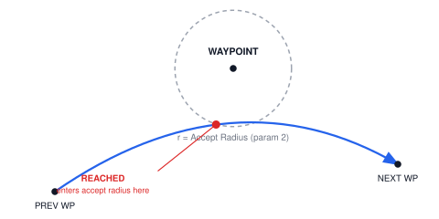
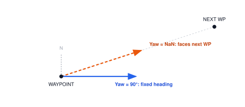
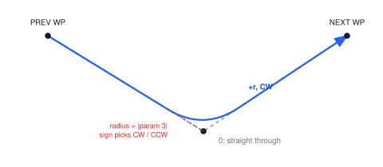
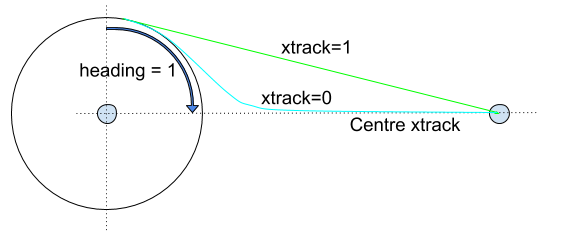
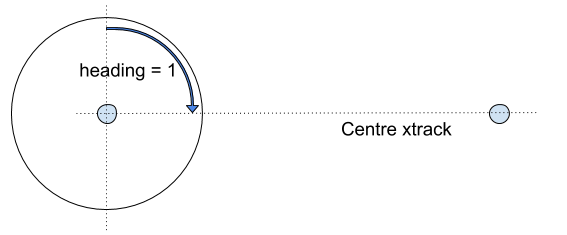
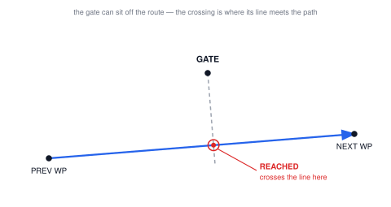

# Mission Item Detail

This page is for clarifications and additional information about common mission items ("MAV_CMD"s used in [plans](mission.md#mavlink_commands)).
In particular it is intended for cases that are difficult to document in the specification XML, or when images will much better describe expected behaviour.

## `NAV_` Items

Navigation items typically have the prefix `MAV_CMD_NAV_`.
These define positions that are destinations on the path.

### MAV_CMD_NAV_WAYPOINT {#nav_waypoint}

[MAV_CMD_NAV_WAYPOINT](../messages/common.md#MAV_CMD_NAV_WAYPOINT) represents a basic waypoint/destination in a mission.
As a destination item, it always requires a position (params 5–7) to say where "this point" is.

It is considered **reached** the instant the vehicle enters a sphere of radius _Accept Radius_ (param 2) around the point.
The vehicle may "cut the corner" as shown below.

#### Params

| Param (:Label)   | Description                                                                      |
| ---------------- | -------------------------------------------------------------------------------- |
| 1: Hold          | Hold time (ignored by fixed-wing; time to stay at the waypoint for rotary-wing). |
| 2: Accept Radius | Acceptance radius — the "reached" trigger described above.                       |
| 3: Pass Radius   | Corner-shaping only — see [Pass Radius](#pass_radius) below.                     |
| 4: Yaw           | Heading at the waypoint (rotary-wing only) or NaN. See [Yaw](#yaw).              |
| 5: Latitude      | Latitude of the waypoint (required).                                             |
| 6: Longitude     | Longitude of the waypoint (required).                                            |
| 7: Altitude      | Altitude of the waypoint (required).                                             |

Neither flight stack validates altitude — an unset (`NaN`) value isn't rejected, it's simply copied into the navigation setpoint as-is. So it doesn't fail cleanly, it just doesn't do what you intended: always send a real value.

#### Yaw (heading at the waypoint) {#yaw}

Param 4 (_Yaw_) sets the vehicle's desired heading once it reaches the point (an absolute compass angle).
It only applies to rotary-wing vehicles.
`NaN` leaves it to a system-wide default heading behaviour (PX4: `MPC_YAW_MODE`; ArduPilot: `WP_YAW_BEHAVIOR`) — normally to face the next waypoint.

#### Pass Radius (Corner Shaping) {#pass_radius}

Param 3 (_Pass Radius_) shapes the turn: `0` flies straight through the point; a non-zero value flies by, offset up to that radius, rounding the corner (sign selects clockwise/counter-clockwise).

If you need an exact, turn-independent trigger point (for example a survey-edge camera trigger) use [MAV_CMD_CONDITION_GATE](#condition_gate).

#### Autopilot Support

ArduPilot:

- _Pass Radius_ (param3) implemented only on ArduPlane. It doesn't curve the flight path — it moves the acceptance point further out along the inbound course, so the corner is still flown straight, just cut sooner.
  Other vehicle types ignore it.

PX4:

- _Pass Radius_ (param3) not implemented. A non-default value for param 3 is rejected.

### Loiter Commands (`MAV_CMD_NAV_LOITER_*`) {#loiter_commands}

Loiter commands are provided to allow a vehicle to hold at a location for a specified time or number of turns, until it reaches the specified altitude, or indefinitely.
Multicopter vehicles stop at the specified point (within a _vehicle-specific_ acceptance radius that is not set by the mission item).
Forward-moving vehicles (e.g. fixed-wing) _circle_ the point with the specified radius/direction.

The commands are:

- [MAV_CMD_NAV_LOITER_TIME](../messages/common.md#MAV_CMD_NAV_LOITER_TIME) - Loiter at specified location for a given amount of time after reaching the location.
- [MAV_CMD_NAV_LOITER_TURNS](../messages/common.md#MAV_CMD_NAV_LOITER_TURNS) - Loiter at specified location for a given number of turns.
- [MAV_CMD_NAV_LOITER_TO_ALT](https://mavlink.io/en/messages/common.html#MAV_CMD_NAV_LOITER_TO_ALT) - Loiter at specified location until desired altitude is reached.
- [MAV_CMD_NAV_LOITER_UNLIM](../messages/common.md#MAV_CMD_NAV_LOITER_UNLIM) - Loiter at specified location for an unlimited amount of time, yawing to face a given direction.

The location and fixed-wing loiter radius parameters are common to all commands:

| Param (:Label) | Description                                                                  | Units |
| -------------- | ---------------------------------------------------------------------------- | ----- |
| 3: Radius      | Radius around waypoint. If positive loiter clockwise, else counter-clockwise | m     |
| 5: Latitude    | Latitude                                                                     |
| 6: Longitude   | Longitude                                                                    |
| 7: Altitude    | Altitude                                                                     | m     |

The loiter time and turns are set in param 1 for the respective messages.
The direction of loiter for `MAV_CMD_NAV_LOITER_UNLIM` can be set using `param4` (Yaw).

::: info
The remaining parameters (xtrack and heading) apply only to forward flying aircraft (not multicopters!)
:::

Xtrack and heading define the location at which a forward flying (fixed wing) vehicle will _exit the loiter circle, and its path to the next waypoint_ (these apply only to `MAV_CMD_NAV_LOITER_TIME` and `MAV_CMD_NAV_LOITER_TURNS`).

| Param (:Label)      | Description                                                                                                                                                                                                                                                                                                                                                             | Units                   |
| ------------------- | ----------------------------------------------------------------------------------------------------------------------------------------------------------------------------------------------------------------------------------------------------------------------------------------------------------------------------------------------------------------------- | ----------------------- |
| 2: Heading Required | Leave loiter circle only once heading towards the next waypoint (0 = False)                                                                                                                                                                                                                                                                                             | min:0 max:1 increment:1 |
| 4: Xtrack Location  | Sets xtrack path or exit location: `0` for the vehicle to converge towards the center xtrack when it leaves the loiter (the line between the centers of the current and next waypoint), `1` to converge to the direct line between the location that the vehicle exits the loiter radius and the next waypoint. NaN to use the current system default xtrack behaviour. |

The recommended values (and resulting paths) are those shown below.

The vehicle leaves the loiter after it reaches the desired number of turns or time _and_ based on **both** the `heading required` and `xtrack` params.

A `heading required` of `1` prevents the vehicle from exiting the loiter unless it is heading towards the next waypoint (if `0` it can leave at any point provided the other conditions are met).
With this setting the vehicle can leave at any point in the arc shown, provided it meets the other conditions (e.g. xtrack).
If necessary (i.e. it is not in the arc when the other conditions are met), the vehicle will loop back around the loiter before it evaluates the xtrack condition.

The Xtrack parameter independently defines the path and exit location:

- `xtrack=0`: Exit the loiter circle and converge to the centre xtrack between this and the next waypoint.
  - If the heading required parameter is not set it will exit the loiter immediately.
  - Otherwise it will leave as soon as it is heading towards the next waypoint (which may also be immediately!)
- `xtrack=1`: Exit the loiter circle and fly/converge to the straight line between the exit point and the centre of the next waypoint (i.e. don't converge to the centre xtrack).
  - If the heading required parameter is set it will exit the loiter as soon as it is heading towards the next waypoint (which may be immediately!).
  - If the heading required parameter is not set it will exit the loiter immediately (note that this exit path does not make much sense unless the heading parameter is set).
- `xtrack=NaN`: Exit the loiter using "system specific default behaviour".
  - The vehicle must still respect the heading required param.
  - Usually this is synonymous with `xtrack=0`

## `CONDITION_` Items

### MAV_CMD_CONDITION_GATE {#condition_gate}

[MAV_CMD_CONDITION_GATE](../messages/common.md#MAV_CMD_CONDITION_GATE) (id 4501) marks an off-path location (not a destination) that indirectly defines where on the path to the _next_ waypoint the condition is accepted.

When the gate is reached, the vehicle flies directly towards the _next_ mission item that is on the path (such as a waypoint).
The mission state machine is blocked on the gate mission item until the vehicle reaches the point on the path that is perpendicular to the gate location.
This can be used for triggering a `DO_*` action (camera, speed change, etc.) at a precise point along a leg, without affecting the route itself.

#### Params

| Param (:Label) | Description                                                                                    |
| -------------- | ---------------------------------------------------------------------------------------------- |
| 1: Geometry    | Geometry of the gate test. `0`: line orthogonal to the path (no other values defined/allowed). |
| 2: UseAltitude | [MAV_BOOL_TRUE](../messages/common.md#MAV_BOOL) if altitude is included in the crossing test.  |
| 3:             |                                                                                                |
| 4:             |                                                                                                |
| 5: Latitude    | Latitude of the gate.                                                                          |
| 6: Longitude   | Longitude of the gate.                                                                         |
| 7: Altitude    | Altitude of the gate.                                                                          |

#### Autopilot support

ArduPilot:

- Not supported. See [ardupilot#13778](https://github.com/ArduPilot/ardupilot/issues/13778).

PX4:

- Supported from PX4v1.11
- `UseAltitude` field ignored (geometry test is 2D)
- A gate within 5 cm of a neighboring waypoint is rejected as infeasible.
