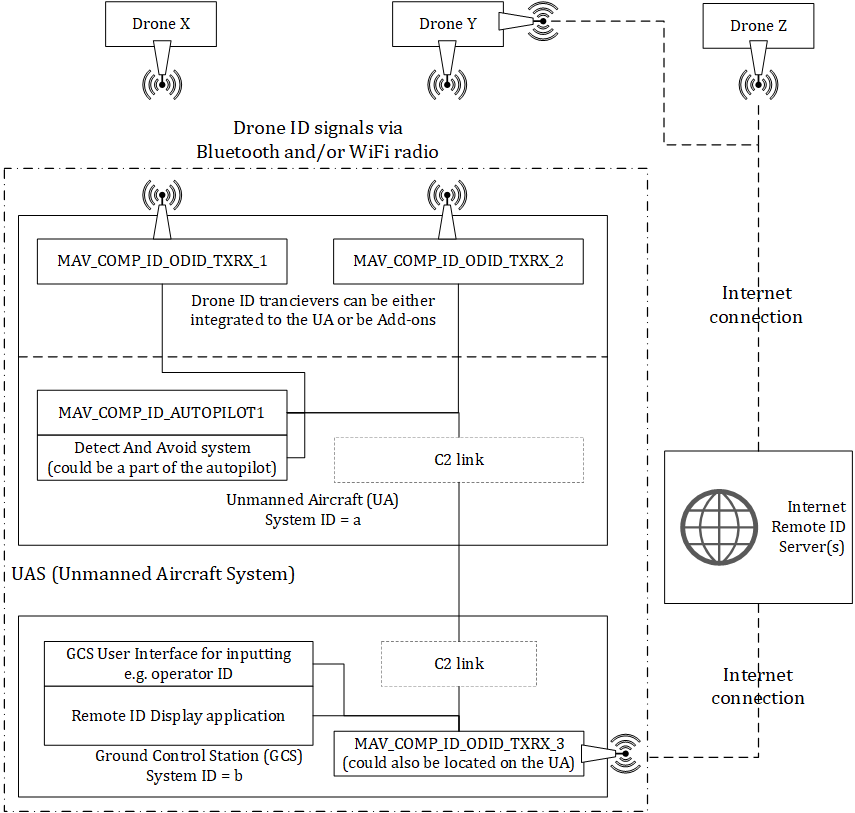

# Open Drone ID

Direct Remote Identification (DRI) or Remote ID (RID) is/will be a mandatory technology for Unmanned Aircraft (UA) in Japan, the United States of America and the European Union.
[Data](https://github.com/opendroneid/opendroneid-core-c#comparison) such as the UA real-time location/altitude, UA serial number, operator ID/location etc. are broadcast via either Wi-Fi or Bluetooth from the UA.
[Open Drone ID](https://github.com/opendroneid/opendroneid-core-c) is an open source implementation of RID.

The terms Remote ID and drone ID are used interchangeably in the text below.

## Relevant specifications {#specifications}

The MAVLink messages defined for usage with Open Drone ID are compliant with the following standards:

- ASTM F3411 Specification for Remote ID and Tracking
- ASD-STAN prEN 4709-002 Direct Remote Identification

For additional details, please see [here](https://github.com/opendroneid/opendroneid-core-c#relevant-specifications).
In general, the front page of the [opendroneid core-c](https://github.com/opendroneid/opendroneid-core-c) repository has lots of pointers to additional information and SW projects related to drone ID.

## Broadcast methods and impact on the message design {#broadcast_methods}

Four different broadcast methods are defined:

- Bluetooth Legacy Advertising (Bluetooth 4.x)
- Bluetooth Long Range with Extended Advertising (Bluetooth 5.x)
- Wi-Fi Neighbor-aware Network (Wi-Fi NaN)
- Wi-Fi Beacon (vendor specific information element in the SSID beacon frame)

The broadcast method used with Bluetooth Legacy Advertising signals impose a strict size limitation on the amount of data that can be transmitted in each radio burst.
Therefore the relevant data is divided into different categories and each category is transmitted via its own message.

The standards defines 6 such messages and an additional 7th message type for packing multiple messages together into a message pack (used when transmitting on Wi-Fi NaN, Wi-Fi Beacon or Bluetooth Long Range with Extended Advertising).
To support easy data transfers to/from a Remote ID (RID) transmitter/receiver component, MAVLink messages supporting all the fields of the drone ID messages have been made available.
See [Messages](#messages) below.

## Use case examples {#use_cases}

There are multiple possible use cases for the MAVLink drone ID messages:

- A flight controller sends ID, location etc. data to an onboard Bluetooth/Wi-Fi RID transmitter component.
- An onboard Bluetooth/Wi-Fi receiver picks up drone ID messages from surrounding aircraft, relays this information using MAVLink drone ID messages to the flight controller, which then uses the information e.g. for Detect And Avoid (DAA) calculations.
- A drone sends MAVLink drone ID messages via its control link to the Ground Control Station (GCS).
  The GCS is connected via the Internet to a Remote ID server, which stores and publishes the drone's ID, location etc.
- As above but in the other direction for DAA calculations.
- A Remote ID Display application (RID) on the GCS listens to all drone ID data received from surrounding UAs and displays their position to the operator.

## Messages {#messages}

The ASTM, ASD-STAN and MAVLink messages are listed below.

| ASTM                                                    | ASD-STAN                 | MAVLink                                                                            | Purpose                                                                                                                                                                                                                                                                                                                                                                                                                                                                    |
| ------------------------------------------------------- | ------------------------ | ---------------------------------------------------------------------------------- | -------------------------------------------------------------------------------------------------------------------------------------------------------------------------------------------------------------------------------------------------------------------------------------------------------------------------------------------------------------------------------------------------------------------------------------------------------------------------- |
| Basic ID             | Basic ID                 | [OPEN_DRONE_ID_BASIC_ID](../messages/common.md#OPEN_DRONE_ID_BASIC_ID)             | Provides an ID for the UA, characterizes the type of ID and identifies the type of UA.                                                                                                                                                                                                                                                                                                                                                                                     |
| Location             | Location                 | [OPEN_DRONE_ID_LOCATION](../messages/common.md#OPEN_DRONE_ID_LOCATION)             | Provides location, altitude, direction, and speed of the UA.                                                                                                                                                                                                                                                                                                                                                                                                               |
| Authentication | Not specified (reserved) | [OPEN_DRONE_ID_AUTHENTICATION](../messages/common.md#OPEN_DRONE_ID_AUTHENTICATION) | Provides authentication data for the UA.                                                                                                                                                                                                                                                                                                                                                                                                                                   |
| Self-ID               | Self-ID                  | [OPEN_DRONE_ID_SELF_ID](../messages/common.md#OPEN_DRONE_ID_SELF_ID)               | Optional plain text message that can be used by operators to identify themselves and the purpose of an operation. Can also be used to provide optional additional clarification in an emergency/remote ID system failure situation.                                                                                                                                                                                                                                        |
| System                 | System                   | [OPEN_DRONE_ID_SYSTEM](../messages/common.md#OPEN_DRONE_ID_SYSTEM)                 | Includes the operator location/altitude, multiple aircraft information (group/swarm, if applicable), full timestamp and possible category/class information.                                                                                                                                                                                                                                                                                                               |
| Operator ID       | Operator ID              | [OPEN_DRONE_ID_OPERATOR_ID](../messages/common.md#OPEN_DRONE_ID_OPERATOR_ID)       | Provides the operator ID.                                                                                                                                                                                                                                                                                                                                                                                                                                                  |
| Message Pack     | Message Pack             | [OPEN_DRONE_ID_MESSAGE_PACK](../messages/common.md#OPEN_DRONE_ID_MESSAGE_PACK)     | A payload mechanism for combining the messages above into a single message pack. Used with Bluetooth Extended Advertising, Wi-Fi NaN and Wi-Fi Beacon.                                                                                                                                                                                                                                                                                                                     |
| \_                                                      | \_                       | [OPEN_DRONE_ID_ARM_STATUS](../messages/common.md#OPEN_DRONE_ID_ARM_STATUS)         | Sent by RID transmitter/receiver components to indicate that the RID system is "ready to use". This should be used as an arming condition for the flight stack. Note that this differs from the [HEARTBEAT](#heartbeat) which indicates that the component is "alive" but not necessarily ready to use.                                                                                                                                                                    |
| \_                                                      | \_                       | [OPEN_DRONE_ID_SYSTEM_UPDATE](../messages/common.md#OPEN_DRONE_ID_SYSTEM_UPDATE)   | A subset of the [OPEN_DRONE_ID_SYSTEM](#OPEN_DRONE_ID_SYSTEM) message, containing only the fields that must be updated at a high rate. Typically sent from the GCS to provide data to the RID transmitter component. If both `OPEN_DRONE_ID_SYSTEM` and `OPEN_DRONE_ID_SYSTEM_UPDATE` are used, the more efficient `OPEN_DRONE_ID_SYSTEM_UPDATE` will be used at a high rate and the full `OPEN_DRONE_ID_SYSTEM` at a low rate, to reduce the traffic on the control link. |

> **Note** The raw byte layout of the MAVLink messages is not exactly the same as what a RID Bluetooth/Wi-Fi transmitter component will broadcast over the air.
> Slight compression is applied.
> Example code for this conversion can be found in the project: [Open Drone ID Core C Library](https://github.com/opendroneid/opendroneid-core-c).

The [Open Drone ID Core C Library](https://github.com/opendroneid/opendroneid-core-c) contains code for decoding the MAVLink messages and "compressing" the data into data structures for broadcast over Bluetooth or Wi-Fi (or vice-versa for reception).

The standards do not impose any requirements for a drone to be capable of receiving drone ID messages, nor any requirements for reacting to their content (requirements from local legislation might be different).

An example Android receiver implementation for Bluetooth/Wi-Fi drone ID is [available here](https://play.google.com/store/apps/details?id=org.opendroneid.android_osm) ([source codes](https://github.com/opendroneid/receiver-android)).

Code related to (Internet) Network Remote ID can be found in the [InterUSS Project](https://github.com/interuss) and https://github.com/uastech/standards (Unofficial reference for UAS-related APIs).

## Message update rates {#update_rates}

ASTM F3411 and ASD-STAN prEN 4709-002 (and possibly other [standards](#specifications)) require that the [LOCATION](#OPEN_DRONE_ID_LOCATION) message is broadcast/published from the RID transmitter component at least once per second.
The rest of the messages must be broadcast/published once per 3 seconds (the rules in some regions have tightened this requirement to 1 second for also the [BASIC ID](#OPEN_DRONE_ID_BASIC_ID) and the [SYSTEM](#OPEN_DRONE_ID_SYSTEM) message.
Please see [here](https://github.com/opendroneid/opendroneid-core-c#comparison)).

Not all message types or fields within a message type are mandatory to broadcast/publish.
The mandatory message set vary from region to region.
Please see the [summary](https://github.com/opendroneid/opendroneid-core-c#comparison).

The standards require that the data contained in the [LOCATION](#OPEN_DRONE_ID_LOCATION) and the [SYSTEM](#OPEN_DRONE_ID_SYSTEM) messages (on the air/internet) is not older than 1 second (the location data, timestamps etc.).

To be compliant in different regions and receive certification acceptance, the UAS as a complete entity must obey the above timing restrictions.
Although popular autopilot SW stacks will be verified to be capable of this, the compliance testing will have been done using a certain set of HW/SW components.
Any deviation from this set, will require the integrator of the UAS to consider the combination of the above requirements when deciding the internal update rates for each component, in the MAVLink network, generating data for the RID transmitter component.

It must be expected that there will be some delays from e.g. the GCS sending a [SYSTEM](#OPEN_DRONE_ID_SYSTEM) message via the flight controller to the RID transmitter component.
The RID transmitter component will gather this data plus data from other messages together and generate the final message data set, which is broadcast over the air.
Each of these components will be running on their own update and forward/relay cycle and can thus introduce delays.
I.e. running everything at exactly one second cycles, probably will lead to violations of the data "freshness" requirement.
But going to the other extreme of forcing all messages to be at 10+ Hz would likely lead to unnecessary airwave noise on the (Command and Control) C2 link/Wi-Fi/Bluetooth spectrum.
Components are expected to tune refresh rates to ensure compliance, without saturating internal communication links.

RID broadcasting using Bluetooth 4 Legacy Advertising introduces additional complexity to this.
For Bluetooth 5 or Wi-Fi Beacon/NaN, all messages are packed together and broadcast in a single advertisement by the RID transmitter component.
Bluetooth 4 advertisements can only contain 25 bytes and thus can fit only a single message.
Since typically at least three messages must be broadcast on the air per second, the BT4 RID transmitter component must advertise at least every 333 ms.

## Routing drone ID MAVLink messages inside the UAS {#routing}

There can be multiple MAVLink components in an UAS involved in the handling of drone ID data.
An example is shown in the figure below.
Certainly not all UAS will contain all of these components and the placement of some of them can be different from one system to another.

All senders of MAVLink drone ID messages must fill the `sysid` [field](https://github.com/ArduPilot/pymavlink/blob/master/generator/C/include_v2.0/mavlink_types.h#L115) with the MAVLink system ID value that the MAVLink sender component belongs to and fill the `compid` [field](https://github.com/ArduPilot/pymavlink/blob/master/generator/C/include_v2.0/mavlink_types.h#L116) with the MAVLink component ID value of the sender.

The MAVLink components or systems that will typically generate drone ID MAVLink messages are listed in the table below:

| Component/System                                                         | Description                                                                                                                                            |
| ------------------------------------------------------------------------ | ------------------------------------------------------------------------------------------------------------------------------------------------------ |
| [MAV_COMP_ID_AUTOPILOT1](../messages/common.md#MAV_COMP_ID_AUTOPILOT1)   | The flight controller/autopilot. Knows the ID of the UA, the current location, altitude, speed etc.                                                    |
| Ground Control Station                                                   | GCS with a human user interface for inputting the operator ID, text description of the flight purpose, method for obtaining the operator location etc. |
| [MAV_COMP_ID_ODID_TXRX_1](../messages/common.md#MAV_COMP_ID_ODID_TXRX_1) | A Remote ID transmitter/receiver component (Bluetooth/Wi-Fi/Internet).                                                                                 |
| [MAV_COMP_ID_ODID_TXRX_2](../messages/common.md#MAV_COMP_ID_ODID_TXRX_2) | A Remote ID transmitter/receiver component (Bluetooth/Wi-Fi/Internet).                                                                                 |
| [MAV_COMP_ID_ODID_TXRX_3](../messages/common.md#MAV_COMP_ID_ODID_TXRX_3) | A Remote ID transmitter/receiver component (Bluetooth/Wi-Fi/Internet).                                                                                 |

The autopilot/flight controller is typically the component that knows about the data needed for the [BASIC ID](#OPEN_DRONE_ID_BASIC_ID) and the [LOCATION](#OPEN_DRONE_ID_LOCATION) messages.
It must stream MAVLink messages with this information to the RID transmitter component.

The Ground Control Station system is the interface for the operator of the UAS.
The operator must enter the data needed for the [SELF_ID](#OPEN_DRONE_ID_SELF_ID), the [SYSTEM](#OPEN_DRONE_ID_SYSTEM) and the [OPERATOR_ID](#OPEN_DRONE_ID_OPERATOR_ID), messages before the flight.
The GCS must send this data via MAVLink messages to the RID transmitter component (possibly via the autopilot component).
If the GCS is capable of regularly obtaining its own location, these updates are sent in the [SYSTEM](#OPEN_DRONE_ID_SYSTEM) message together with a full timestamp.

The UAS has one or more RID transmitter components for publishing the drone ID data to the rest of the world, either via Bluetooth or Wi-Fi broadcasts, or via an internet connection to an internet Remote ID server.
The RID transmitter components will listen to the MAVLink messages from the flight controller and the GCS but must ignore MAVLink messages where the `compid` [field](https://github.com/ArduPilot/pymavlink/blob/master/generator/C/include_v2.0/mavlink_types.h#L116) is set to [MAV_COMP_ID_ODID_TXRX_1](../messages/common.md#MAV_COMP_ID_ODID_TXRX_1), [MAV_COMP_ID_ODID_TXRX_2](../messages/common.md#MAV_COMP_ID_ODID_TXRX_2) or [MAV_COMP_ID_ODID_TXRX_3](../messages/common.md#MAV_COMP_ID_ODID_TXRX_3) (those MAVLink messages would have originated from a RID receiver component and would be the drone ID information from [other UAs](other_ua)).
The method for the RID transmitter components to identify MAVLink messages from the GCS, is described in the [Heartbeat](#heartbeat) section below.

The MAVLink components in the UAS involved in the drone ID MAVLink message exchange, must keep track of the `HEARTBEAT` MAVLink messages from the other MAVLink components.
If the `HEARTBEAT` messages are not received within a required time interval, they must declare a malfunction of the Remote ID system and indicate this in the `status` field of the [LOCATION](#OPEN_DRONE_ID_LOCATION) message.
This must also be indicated to the operator of the UAS.

Similarly, the autopilot must listen to the [ARM_STATUS](#OPEN_DRONE_ID_ARM_STATUS) from the RID transmitter component(s) and not allow the UA to be airborne before the RID transmitter component(s) is ready.
During flight, if the arm status indicates a failure, similar action must be taken as for a lack of `HEARTBEAT` messages from the RemoteID.
The [ARM_STATUS](#OPEN_DRONE_ID_ARM_STATUS) message must also be routed to a GCS, if present, allowing it to provide more detailed information about RemoteID arming failures.

> **Note** In addition to the above, there are multiple additional different scenarios that must result in the Location status field being set to Emergency or Remote ID System Failure.
> The exact strategy on how to avoid having multiple MAVLink components overwriting each-others emergency declarations is not yet fully defined.
> Some preliminary discussion can be found [here](https://github.com/ArduPilot/ArduRemoteID/issues/34).

Optionally, further restrictions on which RID transmitter/receiver component must process a MAVLink message can be enforced if the sender fills the `target_system` and `target_component` fields of the MAVLink message.
RID transmitter/receiver components must only listen to MAVLink messages that have these fields set to either zero (broadcast) or the component's own MAVLink system ID and component ID.
This can be useful if e.g. there are two UA connected to a single GCS.
The GCS can then direct information to specific MAV_COMP_ID_ODID_TXRX_x components on a specific UA.
By default, all senders of drone ID MAVLink messages must fill the `target_system` and `target_component` fields with zero, to indicate a broadcast to all MAVLink components.

### Open Drone ID data from other UA(s) {#other_ua}

It is possible that the RID transmitter components also work as receivers, for obtaining drone ID data from surrounding UAs.
When publishing the received drone ID data as internal MAVLink messages, they must set the `compid` [field](https://github.com/ArduPilot/pymavlink/blob/master/generator/C/include_v2.0/mavlink_types.h#L116) to their own MAV_COMP_ID_ODID_TXRX_n ID to make it possible to distinguish this data from the drone ID data of the UA itself.
Also the `systemid` [field](https://github.com/ArduPilot/pymavlink/blob/master/generator/C/include_v2.0/mavlink_types.h#L115) must be set with the MAVLink system ID value that the RID receiver component belongs to.

At least two possible consumers of drone ID data from surrounding aircraft are possible:

- A Detect And Avoid (DAA) system that tracks the current and estimated future positions of other UAs and takes that into account when setting the flight path of the UA itself.
- A Remote ID Display (RID) application that visually shows the surrounding UA's locations (and possibly past and estimated future flight paths) to the operator of the UA, in order for him/her to utilize this information when controlling the UA.

See [below](#combining) on how to combine remote ID data from other UAs.

### Heartbeat {#heartbeat}

Each component involved in the MAVLink message exchange, is required to regularly send out MAVLink [HEARTBEAT](../messages/common.md#HEARTBEAT) messages in order to facilitate discovery and monitoring of the component in the UAS.
Please see further details in the [HEARTBEAT](heartbeat.md) documentation.

For RID transmitter/receiver components (with `compid`s [MAV_COMP_ID_ODID_TXRX_1](../messages/common.md#MAV_COMP_ID_ODID_TXRX_1), [MAV_COMP_ID_ODID_TXRX_2](../messages/common.md#MAV_COMP_ID_ODID_TXRX_2) or [MAV_COMP_ID_ODID_TXRX_3](../messages/common.md#MAV_COMP_ID_ODID_TXRX_3)), the `type` field in the [HEARTBEAT](../messages/common.md#HEARTBEAT) message must be filled with [MAV_TYPE_ODID](../messages/common.md#MAV_TYPE_ODID).

The MAVLink [HEARTBEAT](../messages/common.md#HEARTBEAT) message serves as the way for RID transmitter/receiver components to identify the `sysid` of the GCS.
The GCS will send out MAVLink [HEARTBEAT](../messages/common.md#HEARTBEAT) messages with its `sysid` [field](https://github.com/ArduPilot/pymavlink/blob/master/generator/C/include_v2.0/mavlink_types.h#L115) set to the GCS's MAVLink system ID and the `type` set to [MAV_TYPE_GCS](../messages/common.md#MAV_TYPE_GCS).
The RID transmitter/receiver components must interpret all MAVLink Open Drone ID messages from that system ID, as coming from the GCS.
There is no dedicated MAVLink component ID for GCSs, hence the MAVLink system ID must be used instead for identifying the GCS.

## Possible future improvements {#improvements}

The current set of MAVLink drone ID messages do not provide any means for controlling some of the RID transmitter/receiver component details.
The RID transmitter/receiver component must be hard-coded by the manufacturer to a certain configuration.
Some discussion and proposal for this type of messages can be found [here](https://github.com/mavlink/mavlink/pull/1865).
It would be useful to control e.g. the following items:

- Starting/stopping broadcast
- Configure the broadcast method (BT4, BT5, Beacon, NaN)
- Wi-Fi channel configuration for Beacon
- Message update rates on the air

No regions currently require drone ID publication via the internet (Network Remote ID).
However, it is possible that in the future this will change from being optional to mandatory for some use cases/regions as a part of the [UTM](https://www.faa.gov/uas/research_development/traffic_management)/[USpace](https://www.easa.europa.eu/what-u-space) efforts.
Currently there are no suitable MAVLink messages defined to configure a Network Remote ID transceiver.
Messages to specify the server(s) to connect to, credentials etc. would be needed.

Security of drone ID data is partly under definition.
The Japan rule requires a signature of the drone ID data to be broadcasted in the [AUTHENTICATION](#OPEN_DRONE_ID_AUTHENTICATION) message.
The details are in [Japanese](https://github.com/opendroneid/opendroneid-core-c#japan).
No such requirement currently exists for the US and EU.
It is possible that some use cases in the future might require more security related activities for drone ID data.
Some additional protocol specification work is being drafted by the IETF in the [DRIP](https://github.com/ietf-wg-drip) working group.

## UAS with multiple RID transmitters and/or receiver components {#multiple_transceivers}

Since three different technologies for broadcasting/publishing drone ID data have been defined (Bluetooth, Wi-Fi and internet), it is quite possible for a UAS to support more than just a single type.

For UASs that desire to listen to other UA's information, it would be desirable to include receivers for all three methods, in order to maximize the possibility of detecting all other surrounding UAs.

## Combining data from other UAs when receiving drone ID data {#combining}

For Drone ID data that is received from other UAs, the data of the message itself does not always identify exactly which UA the data originated from.
E.g. for data received via Bluetooth Legacy Advertising (Bluetooth 4.x), many of the received messages will not contain the unique serial number/ID of the UA that broadcasted the data, due to the severe size limitation imposed by Legacy Advertising where only one 25 byte message can be broadcasted in one advertisement radio burst.
The MAC address (possibly randomized) of the Bluetooth HW is the only way to associate these messages to the same UA.
For Bluetooth 5.x and Wi-Fi, it is possible that the same can happen in certain specific situations (e.g. sending large amount of authentication data), although for the majority of normal usage this is unlikely, since the use of [MESSAGE_PACK](#OPEN_DRONE_ID_MESSAGE_PACK)s is mandated.
For data received via internet, the data packet will always contain the unique serial number/ID of the originating UA but no associated MAC address.

In order to allow e.g. a DAA component to sort and identify which UA each data message has originated from, the RID receiver components must add, to the MAVLink message, either the MAC address or the ID number associated with the UA that originated the data message, before sending it on the internal UAS MAVLink network.
This information must be added in the `id_or_mac` field of each MAVLink message.

The serial/ID is copied directly from the `uas_id` field with NULLs in the unused portion.
The MAC address must be entered in ASCII format with NULLs in the unused portion.
Any separation characters must be removed.
E.g. "30-65-EC-6F-C4-58" or "30:65:EC:6F:C4:58" must be represented as the ASCII string "3065EC6FC458".
When not used for the above purpose, the `id_or_mac` field must be filled with NULLs.

The MAVLink system/component listening to the MAVLink messages must be aware that it is possible to receive drone ID data from the same UA via multiple receive paths (e.g. Wi-Fi and internet).
Filtering and merging of the data (and possible deletion of duplicates) will be needed and it must keep track of both a possible MAC address and the serial/ID of the other UAs.
Additional filtering and sorting based on the timestamp in the [LOCATION](#OPEN_DRONE_ID_LOCATION) or [SYSTEM](#OPEN_DRONE_ID_SYSTEM) messages can also be needed in order to generate a consistent flight path for the other UAs.
