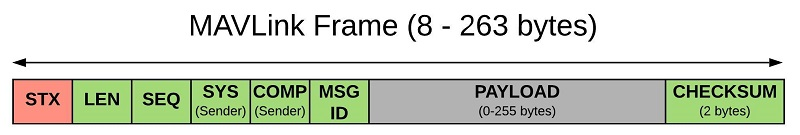
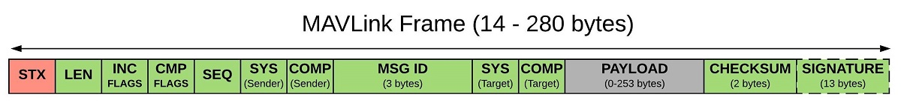

# Packet Serialization

This topic provides detailed information about about MAVLink packet serialization, including the over-the-wire formats for MAVLink v1 and v2 packets, the ordering of fields in the message payload, and the CRC_EXTRA used for ensuring that the sender and reciever share a compatible message definition.

It is primarily intended for developers who are creating/maintaining a MAVLink generator

> **Tip** MAVLink users do not typically need to understand the serialization format, as encoding/decoding is handled by the MAVLink libraries.

<!--
## MAVLink Serialization for MAVLink Users

Generally speaking most MAVLink users do not need to understand the details of the serialization format;
The MAVLink generators create helper APIs that handle message encoding and decoding.


For example, this function is provided for sending the altitude message. 
Behind the scenes the serializer takes care of encoding the message and sending it out on the serial port.


```c
static inline void mavlink_msg_attitude_send(mavlink_channel_t chan,
uint32_t time_boot_ms, float roll, float pitch, float yaw,
float rollspeed, float pitchspeed, float yawspeed);
```


```python
def attitude_send(self, usec, roll, pitch, yaw,
rollspeed, pitchspeed, yawspeed):
```



Whatever language you are using, the resulting binary data will be the same:

```
0x55 0x1C 0x1E <time> <roll> <pitch> <yaw>
<rollspeed> <pitchspeed> <yawspeed> <crc1> <crc2>
```
-->

## Packet Format {#packet_format}

This section shows the serialized message format of MAVLink packets (the format is inspired by the [CAN](https://en.wikipedia.org/wiki/CAN_bus) and SAE AS-4 standards).

### MAVLink 1 Packet Format {#v1_packet_format}

Below is the over-the-wire format for a MAVLink 1 packet (the in-memory representation might differ).



| Byte Index                          | C version                  | Content                                     | Value             | Explanation                                                                                                                                                             |
| ----------------------------------- | -------------------------- | ------------------------------------------- | ----------------- | ----------------------------------------------------------------------------------------------------------------------------------------------------------------------- |
| 0                                   | `uint8_t magic`            | Packet start marker                         | 0xFE              | Protocol-specific start-of-text (STX) marker used to indicate the beginning of a new packet. Any system that does not understand protocol version will skip the packet. |
| 1                                   | `uint8_t len`              | Payload length                              | 0&nbsp;-&nbsp;255 | Indicates length of the following `payload` section.                                                                                                                    |
| 2                                   | `uint8_t seq`              | Packet sequence number                      | 0 - 255           | Used to detect packet loss. Components increment value for each message sent.                                                                                           |
| 3                                   | `uint8_t sysid`            | System ID                                   | 1 - 255           | ID of *system* (vehicle) sending the message. Used to differentiate systems on network.                                                                                 |
| 4                                   | `uint8_t compid`           | Component ID                                | 0 - 255           | ID of *component* sending the message. Used to differentiate components in a *system* (e.g. autopilot and a camera).                                                    |
| <span id="v1_msgid"></span>5          | `uint8_t msgid`            | Message ID                                  | 0 - 255           | ID of *message type* in payload. Used to decode data back into message object.                                                                                          |
| <span id="v1_payload"></span>6 to (n+6) | `uint8_t payload[max 255]` | Payload data                                |                   | Message data. Content depends on message type (i.e. Message ID).                                                                                                        |
| (n+7) to (n+8)                      | `uint16_t checksum`        | [Checksum](#checksum) (low byte, high byte) |                   | X.25 CRC for message (excluding `magic` byte). Includes [CRC_EXTRA](#crc_extra) byte.                                                                                   |

* The minimum packet length is 8 bytes for acknowledgment packets without payload.
* The maximum packet length is 263 bytes for full payload.

### MAVLink 2 Packet Format {#mavlink2_packet_format}

Below is the over-the-wire format for a [MAVLink 2](../guide/mavlink_2.md) packet (the in-memory representation might differ).



| Byte Index                            | C version                  | Content                                                       | Value        | Explanation                                                                                                                                                             |
| ------------------------------------- | -------------------------- | ------------------------------------------------------------- | ------------ | ----------------------------------------------------------------------------------------------------------------------------------------------------------------------- |
| 0                                     | `uint8_t magic`            | Packet start marker                                           | 0xFD         | Protocol-specific start-of-text (STX) marker used to indicate the beginning of a new packet. Any system that does not understand protocol version will skip the packet. |
| 1                                     | `uint8_t len`              | Payload length                                                | 0 - 255      | Indicates length of the following `payload` section.                                                                                                                    |
| 2                                     | `uint8_t incompat_flags`   | [Incompatibility Flags](../guide/mavlink_2.md#incompat_flags) |              | Flags that must be understood for MAVLink compatibility (implementation discards packet if it does not understand flag).                                                |
| 3                                     | `uint8_t compat_flags`     | [Compatibility Flags](../guide/mavlink_2.md#compat_flags)     |              | Flags that can be ignored if not understood (implementation can still handle packet even if it does not understand flag).                                               |
| 4                                     | `uint8_t seq`              | Packet sequence number                                        | 0 - 255      | Used to detect packet loss. Components increment value for each message sent.                                                                                           |
| 5                                     | `uint8_t sysid`            | System ID (sender)                                            | 1 - 255      | ID of *system* (vehicle) sending the message. Used to differentiate systems on network.                                                                                 |
| 6                                     | `uint8_t compid`           | Component ID (sender)                                         | 0 - 255      | ID of *component* sending the message. Used to differentiate components in a *system* (e.g. autopilot and a camera).                                                    |
| <span id="v2_msgid"></span>7 to 9       | `uint32_t msgid:24`        | Message ID (low, middle, high bytes)                          | 0 - 16777215 | ID of *message type* in payload. Used to decode data back into message object.                                                                                          |
| <span id="v2_payload"></span>10 to (n+10) | `uint8_t payload[max 255]` | [Payload](#payload)                                           |              | Message data. Depends on message type (i.e. Message ID) and contents.                                                                                                   |
| (n+11) to (n+12)                      | `uint16_t checksum`        | [Checksum](#checksum) (low byte, high byte)                   |              | X.25 CRC for message (excluding `magic` byte). Includes [CRC_EXTRA](#crc_extra) byte.                                                                                   |
| (n+12) to (n+26)                      | `uint8_t signature[13]`    | [Signature](../guide/message_signing.md)                      |              | (Optional) Signature to ensure the link is tamper-proof.                                                                                                                |

* The minimum packet length is 11 bytes for acknowledgment packets without payload.
* The maximum packet length is 279 bytes for a signed message that uses the whole payload.

## Checksum {#checksum}

The packet format includes a 2-byte CRC to allow detection of message corruption. The checksum is the same as used in ITU X.25 and SAE AS-4 standards ([CRC-16-CCITT](https://en.wikipedia.org/wiki/Cyclic_redundancy_check#Polynomial_representations_of_cyclic_redundancy_checks)), documented in [SAE AS5669A](http://www.sae.org/servlets/productDetail?PROD_TYP=STD&PROD_CD=AS5669A). See the MAVLink source code for [the documented C-implementation](https://github.com/mavlink/c_library_v2/blob/master/checksum.h).

The CRC covers the whole message, excluding `magic` byte and the signature (if present). The CRC includes the [CRC_EXTRA](#crc_extra) byte for ensuring the message definition matches the current version.

## Payload Format {#payload}

Messages are encoded within the MAVLink packet format(s)

* The message id field identifies the actual message to be sent
* The payload field contains the data appropriate to the particular message.

MAVLink [reorders the message fields](#field_reordering) in the payload (from the original [XML Message Definitions](../messages/README.md)) for over-the-wire transmission.

As MAVLink does not include information about the message structure in the payload (in order to reduce overhead), so the meaning, order and size of message fields in the over-the-wire must be understood/agreed by both the sender and receiver.

One extra CRC ([CRC_EXTRA](#crc_extra)) is added to the message checksum that allows a receiver to detect changes in [message specifications](../messages/README.md) that might make the over-the-wire format incompatible: new/removed fields, or changes to field name, data type, order, or array length.

> **Tip** A MAVLink library should notify a bad CRC during decoding if a message specification is incompatible (e.g. the C library [mavlink_parse_char()](../getting_started/use_libraries.md#receiving) gives a status `MAVLINK_FRAMING_BAD_CRC`).

### Field Reordering {#field_reordering}

Message payload fields are reordered for transmission as follows:

* Fields are sorted according to their native data size, first `(u)int64_t` and `double`, then `(u)int32_t`, `float`, `(u)int16_t`, `(u)int8_t`.
* If two fields have the same length, their order is preserved as it was present before the data field size ordering
* Arrays are handled based on the data type they use, not based on the total array size
* The over-the-air order is the same as for the `struct` and thus represents the reordered fields
* The `CRC_EXTRA` field is calculated *after* the reordering, to ensure that a mistake during field reordering will be caught by a faulty CRC. The provided Python, C and C# reference implementations are tested to have the correct field reordering, this is only a concern for custom implementations. 

The only exception to the above reordering is for [MAVLink 2 extension fields](../guide/mavlink_2.md#message_extensions). Extension fields are sent in XML-declaration order and are not included in the [CRC_EXTRA](#crc_extra) calculation. This allows new extension fields to be added without breaking binary compatibility.

> **Warning** This ordering is unique and can be easily implemented in a protocol generator by using a stable sorting algorithm. The alternative to using sorting would be either to use inefficient alignment, which is bad for the target architectures for typical MAVLink applications, or to have function calls in the order of the variable size instead of the application context. This would lead to very confusing function signatures of serialization functions.

<!-- FYI: Field ordering is in pymavlink/generator/mavparse.py - see https://github.com/mavlink/mavlink-devguide/pull/27#issuecomment-349215965 for info -->

### CRC_EXTRA Calculation {#crc_extra}

The `CRC_EXTRA` CRC is required to verify that the sender and receiver have a shared understanding of the over-the-wire format of a particular message.

When the MAVLink code generator runs, it takes a checksum of the XML structure for each message and creates an array define `MAVLINK_MESSAGE_CRCS`. This is used to initialise the `mavlink_message_crcs[]` array in the C/C++ implementation, and is similarly used in the Python (or any other, such as the C# and JavaScript) implementation.

When the sender calculates the checksum for a message it adds the `CRC_EXTRA` byte onto the end of the data that the checksum is calculated over. The recipient calculates a checksum for the received message and adds its own `CRC_EXTRA` for the particular message id. If the `CRC_EXTRA` for the sender and receiver are different the checksums will not match.

This approach ensures that only messages where the sender and recipient are using the same message structure will be decoded (or at least it makes a mistake much more unlikely, as for any checksum application).

If you are doing your own implementation of MAVLink you can get this checksum in one of two ways: you can include the generated headers and use `MAVLINK_MESSAGE_CRCS` to get the right seed for each message type, or you can re-implement the code that calculates the seed.

As MAVLink internally reorders the message fields according to their size to prevent word / halfword alignment issues (see [Data structure alignment](http://en.wikipedia.org/wiki/Data%20structure%20alignment) (Wikipedia) for further reference), and a wrongly implemented reordering potentially can cause inconsistencies as well, the `CRC_EXTRA` is calculated based on the over-the-air message layout rather than the XML order.

> **Note** As discussed in the previous section, [MAVLink 2 extension fields](../guide/mavlink_2.md#message_extensions) are not included in the `CRC_EXTRA` calculation.

This is the Python code that calculates the `CRC_EXTRA` seed:

```python
def message_checksum(msg):
    '''calculate a 8-bit checksum of the key fields of a message, so we
       can detect incompatible XML changes'''
    from .mavcrc import x25crc
    crc = x25crc()
    crc.accumulate_str(msg.name + ' ')
    # in order to allow for extensions the crc does not include
    # any field extensions
    crc_end = msg.base_fields()
    for i in range(crc_end):
        f = msg.ordered_fields[i]
        crc.accumulate_str(f.type + ' ')
        crc.accumulate_str(f.name + ' ')
        if f.array_length:
            crc.accumulate([f.array_length])
    return (crc.crc&0xFF) ^ (crc.crc>>8)
```

<!-- From https://github.com/mavlink/pymavlink/blob/master/generator/mavparse.py#L385 -->

> **Note** This uses the same x25 checksum that is used at runtime. It calculates a CRC over the message name (such as “RAW_IMU”) followed by the type and name of each field, space separated. The order of the fields is the order they are sent over the wire. For arrays, the array length is also added.