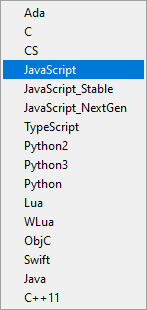

# 生成 MAVLink 库文件

通过使用[代码生成器](../messages/README.md)从*XML格式定义的消息*中生成不同编程语言使用的MAVLink库文件。

This page shows how to use the following two code generators provided with the MAVLink project:

- GUI tool: [mavgenerate](#mavgenerate)
- Command line tool: [mavgen](#mavgen), which is the backend tool used also by mavgenerate

> **Note** These generators can build MAVLink 2 and MAVLink 1 libraries for the following programming languages: C, C++11, Python, Typescript, Java, and WLua. The following programming languages are supported for MAVLink 1 libraries only: C#, JavaScript, ObjC, Swift.

<span></span>

> **Tip** Generators for other programming languages are supported and documented in independent projects. For more information see [Supported Languages](../README.md#supported_languages).

## 先决条件

1. You must already have [Installed the MAVLink toolchain](../getting_started/installation.md), which includes the mavgenerate and mavgen tools used below as well as the [XML Message Definitions](../messages/README.md).
2. If you are generating messages for a [custom dialect](../messages/README.md#dialects), copy the dialect [XML definition file(s)](../messages/README.md#xml-definition-files--dialects) into the directory [message_definitions/v1.0/](https://github.com/mavlink/mavlink/tree/master/message_definitions/v1.0). >**注意***mavgen*可以处理包含XML文件相对路径的方言(例如，最常见的[common.xml](../messages/common.md))，但是其他生成器可能不行。 We recommend putting custom dialects in the same folder as the ones that come with the [mavlink/mavlink](https://github.com/mavlink/mavlink) repository.

## Building MAVLink libraries using the Mavgenerate GUI {#mavgenerate}

**mavgenerate.py**是用Python语言编写的MAVLink的图形用户界面代码生成器。

> **Note** *Mavgenerate* provides a GUI front end to the [mavgen](#mavgen) command line code generator, and supports the same [options](#mavgen_options).

可以使用Pythond的`-m`参数从任何地方打开这个图形用户界面。

```sh
python3 -m mavgenerate
```


Steps for generating the MAVLink library code:

1. Choose the target XML file (typically in [mavlink/message_definitions/1.0](https://github.com/mavlink/mavlink/tree/master/message_definitions/v1.0)).
    
    > **注意**如果使用自定义文件，首先需要将其复制到上面的目录中(如果自定义文件依赖于**common.xml**，则必须确保两者位于同一目录中)。

2. 选择输出路径(例如**mavlink/include**)。

3. Select the target output programming language.
    
    
    
    For JavaScript in particular there are three options:
    
    - `JavaScript_Stable` is an older version that only supports MAVLink 1.0,
    - `JavaScript_NextGen` is a more recent version that supports MAVLink 1 and 2 along with signing.
    - `JavaScript` is a "proxy" for the recommended version. Currently this is `JavaScript_Stable`.

4. Select the target MAVLink protocol version. Ideally use 2.0 if the generator supports it.
    
    > **Caution** Generation will fail if the protocol is not [supported](../README.md#supported_languages) by the selected programming language.

5. Optionally check *Validate* and/or *Validate Units*, which validates XML specifications.

6. Click **Generate** to create the source files for the MAVLink library and the chosen dialect.

## Building MAVLink libraries using the Mavgen Command Line Tool {#mavgen}

**mavgen.py** is a command line tool for generating MAVLink libraries for various programming languages. 将`mavlink`路径添加到`PYTHONPATH`后，可以通过命令行来运行它。

> **Tip** Mavgen is the backend used by [mavgenerate](#mavgenerate). The documentation below explains all the options for both tools.

Below is an example for how to generate *MAVLink 2* libraries for the C programming language using a dialect named **your_custom_dialect.xml**:

```sh
python3 -m pymavlink.tools.mavgen --lang=C --wire-protocol=2.0 --output=generated/include/mavlink/v2.0 message_definitions/v1.0/your_custom_dialect.xml
```

> **Note** The syntax for for generating Python modules is the same, except that the `--output` specifies a *filename* rather than a directory. <!-- https://github.com/ArduPilot/pymavlink/issues/203 -->

<span id="mavgen_options"></span>
The full syntax and options can be output by running `mavgen.py -h` flag, which is reproduced below:

    usage: mavgen.py [-h] [-o OUTPUT]
                     [--lang {C,CS,JavaScript,JavaScript_Stable,JavaScript_NextGen,TypeScript,Python,Lua,WLua,ObjC,Swift,Java,C++11}]
                     [--wire-protocol {0.9,1.0,2.0}] [--no-validate]
                     [--error-limit ERROR_LIMIT] [--strict-units]
                     XML [XML ...]
    
    This tool generate implementations from MAVLink message definitions
    
    positional arguments:
      XML                   MAVLink definitions
    
    optional arguments:
      -h, --help            show this help message and exit
      -o OUTPUT, --output OUTPUT
                            output directory.
      --lang {C,CS,JavaScript,JavaScript_Stable,JavaScript_NextGen,TypeScript,Python,Lua,WLua,ObjC,Swift,Java,C++11}
                            language of generated code [default: Python]
      --wire-protocol {0.9,1.0,2.0}
                            MAVLink protocol version. [默认：1.0]
    --no-validate        不进行XML规范验证。 如果已经确定XML文件是正确的，这样做有助于加快代码生成速度。
      --error-limit ERROR_LIMIT
        可以显示的最大验证错误数
    --strict-units        执行单元属性的验证。