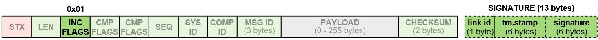

# 消息签名 (身份验证)

[MAVLink 2](../guide/mavlink_2.md) 添加了对消息签名的支持, 允许 MAVLink 系统验证消息是否来自受信任的源。

本主题提供消息签名的概述, 这对于使用现有 MAVLink 库的开发人员和新的 MAVLink 代码生成器的编写者都很有用。 它解释了系统如何确定报文是否已签名、签名是否有效、如何允许接受未签名的报文以及如何创建和共享用于创建签名的 *secret*。

有关使用现有 mavlink 库的开发人员的更多详细信息, 请参见:

* [C 消息签名](../mavgen_c/message_signing_c.md)(mavgen)
* [Pymavlink 消息签名](../mavgen_python/README.md#message_signing)(mavgen) <!-- Others?  -->

## 帧格式

对于已签名的数据包, [incompatibility flag field](../guide/mavlink_2.md#incompat_flags) 的 **0x01** 位设置为 true, 并在数据包中附加另外13个字节的 "签名" 数据。 签名的数据包格式如下。

> **Note** 数据包标头中的 [incompatibility 标志 ](../guide/mavlink_2.md#incompat_flags) 用于指示如果 MAVLink 不识别或无法处理标志, 则必须拒绝数据包。 换句话说, 不支持签名的 MAVLink 库必须丢弃签名的数据包。 C 库使用 [MAVLINK_IFLAG_SIGNED](../guide/mavlink_2.md#MAVLINK_IFLAG_SIGNED) 表示 "支持消息签名" 位。

签字的13字节为：

| 数据                            | 描述                                                                                                    |
| ----------------------------- | ----------------------------------------------------------------------------------------------------- |
| [linkID](#link_ids)(8&nbsp;位) | 发送数据包的链接ID。 通常与*channel*相同。                                                                           |
| [时间戳](#timestamps)(48位)       | 2015年1月1日GMT时间以来的10个微秒时间戳。 这个 *必须* 单步增加每个消息 [链接](#link_ids)。 请注意，如果数据包平均每秒100,000多个数据包，那么时间戳可能早于实际时间。 |
| [签名](#signature)(48位)         | 基于完整的数据包、时间戳和秘密密钥，数据包有48位签名。                                                                          |

见下文关于字段的更多信息。

### 链接 ID {#link_ids}

提供了8位链接ID，以确保签名系统对多链接 MAVLink 系统足够强大。 每个执行都应该指定一个链接ID，指定它启用的 MAVLink 通信渠道，并将此ID置于链接ID字段中。 链接 ID 特别重要，因为不同链接（如WiFi，加上遥控无线电广播）之间可能存在巨大的潜在差异。

每条逻辑流都单独适用单一图形增加的 [timestamp](#timestamp) 规则，其中一个流是由图波定义的：

    (系统 id、组件 id、链接 id)
    

> **Note** 有关详细信息, 请参阅 [C Message Signing > Handling Link IDs](../mavgen_c/message_signing_c.md#handling_link_ids)。

### 签名 {#signature}

48位(6byte) 签名是 SHA-256 完整包的第48位(无签名，但包括时间戳)，附在[秘密密钥](#secret_key)上。 密钥是 MAVLink 通道（即自动试验、地面站或 MAVLink API）两个终端储存的二进制数据的32字节。

这如下所示, 其中 ` + ` 表示串联, `sha256_48()` 是一个 sha256 实现, 它返回正常 sha256 输出的前 48位:

    signature = sha256_48(secret_key + header + payload + CRC + link-ID + timestamp)
    

## 时间戳处理 {#timestamp}

时间戳是48位，从2015年1月1日起，单位为10微秒。 对于1/1/1970年以来可用的系统（unexpoch），你可以在 14200004 秒内使用抵消。

> **Note** 这是一个松散的定义, 因为下面详细介绍的各种更新机制可能会导致时间戳与实际 GMT 时间有显著差异。

生成的所有时间戳必须至少比同一会话中为同一链接 `(SystemID、组件 id、LinkID)` 元组发送的上一个时间戳多1个时间戳。 如果数据包以每秒100 000多包的速度破裂，时间戳可能提前 GMT 时间。

MAVLink 启用的设备可能不知道当前的 GMT 时间，例如，如果没有可靠的时间源，或者，如果它刚刚启动，并且尚未从GPS 或其他系统中获得时间。

系统应当执行以下规则，以获得可靠的时间戳：

* 当前时间戳应定期储存在持久性储存中(最好至少每分钟一次)
* 启动时使用的时间戳应该是系统时钟和存储时间戳所隐含的时间戳的最大值
* 如果该系统没有一个 RTC 机制，则应当更新其在全球定位系统锁定时时的时间戳。 应该使用全球定位系统和存储时间戳的最大时间戳。
* 从特定链接发送的每个消息中，时间戳应增加一个。
* 当正确签名的信息被解码时，时间戳比当前时间戳高时，时间戳应替换。 > **Note<0> 链接的时间戳绝对不能来自错误签名的包（即使它们已经被 [accepted](#accepting_incorrectly_signed_packets)）</li> 
    
    * 收到的信息上的时间戳，应当与收到的 `(linkID,srcSystem,Srcontents)` 的输出时间戳进行检查，如果信息较小，则该消息被否决。
    * 如果没有之前的信息与给定的 `(linkID,srcSystem,Srcontent)` 那么，如果时间戳不超过600万(1分钟)，则应接受时间戳。</ul> 
    
    > **Tip** 对于在持久存储中存储时间戳的设备, 实现可以通过存储两个时间戳值来防止抢占条件。 在写入时, 应更新两个值中较小的值。 在读取时, 应使用两个值中较大的值。
    
    ## 接受签名包 {#accept_signed_packets}
    
    当签名的数据包到达时, 如果出现以下情况, 则应将其丢弃:
    
    * 时间戳来自同一逻辑流的上一个数据包, 其中逻辑流被定义为具有相同 (`SystemID`、`ComponentID`、`LinkID`) 元组的 MAVLink 数据包的序列。
    * 计算的48位签名与数据包中包含的签名不匹配。 
    * 时间戳在本地系统的时间戳后面超过 1分钟 (6, 000, 000)。
    
    ## 接受未签名包 {#accepting_unsigned_packets}
    
    MAVLink 库应该提供一种机制, 允许系统有条件地接受 *unsigned* 数据包。
    
    接受这些数据包的规则将是特定于实现的, 但可以基于参数设置、传输类型、消息类型、(in) 兼容性标志等的组合。
    
    > **Note** 所有不符合系统特定的未签名数据包接受规则的数据包都必须被拒绝 (否则将无法从登录/身份验证中获得任何好处)。
    
    关于何时接受未签名数据包的一些建议:
    
    * 接受基于系统特定参数的所有未签名数据包。
    * 如果连接是通过 "安全通道" (例如本地 usb 电缆或本地有线以太网电缆), 则接受所有未签名的数据包。
    * `RADIO_STATUS` 数据包总是在不签名的情况下被接受 (以便使遥测数传的工作更轻松)。
    * 在 "无签名模式" (可能由启动时按下的硬件按钮触发) 时接受所有未签名的数据包。
    * 接受所有未签名的数据包, 直到 (无条件地) 收到已签名的数据包, 然后移动到上面更受限制的签名规则。
    
    ## 接受签名不正确的数据包 {#accepting_incorrectly_signed_packets}
    
    MAVLink 库应该提供一种机制, 允许系统有条件地接受签名不正确的数据包。
    
    This feature might be useful for finding a lost vehicle with a corrupted secret key (the GCS could choose to still display position information, albeit ideally with a different "untrusted" icon).
    
    > **Note** A system that is accepting incorrectly signed packets should provide a highly conspicuous indication that the connection is *unsafe*/*insecure*. Malformed signed packets indicate a bad configuration, transport failure, protocol failure, or hostile manipulation.
    
    ## Secret Key Management {#secret_key}
    
    A secret key is 32 bytes of binary data that are used to create message signatures that can be verified by other holders of the key. The key should be created on one system in the network (often a GCS) and shared to other trusted devices via secure channels. Systems must have a shared key in order to be able to communicate.
    
    > **Note** The *mavgen* [C](../mavgen_c/message_signing_c.md) and [Python](../mavgen_python/README.md#message_signing) libraries support only one key per link. This is a choice of the library and not a limit/requirement of the protocol. An implementation might instead store a pool of keys, and/or manage keys on a per-connection basis.
    
    The secret key should be stored in persistent storage, and must not be exposed via any publicly accessible communication protocol. In particular, the key must not be exposed in MAVLink parameters, MAVLink log files or dataflash log files that may be used for public log analysis.
    
    The method of generating the secret key is implementation dependent. For example, it could be generated by:
    
    * A user-entered string that is then run through SHA-256.
    * A random key generator.
    
    The secret key may be shared to other devices using the [SETUP_SIGNING](../messages/common.md#SETUP_SIGNING) message. The message should only ever be sent over a secure link (e.g. USB or wired Ethernet) as a direct message to each connected `system_id`/`component_id`. The receiving system must be set up to process the message and store the received secret key to the appropriate permanent storage.
    
    The same secure method can be used to both *set* and *reset* a system's key (reseting a key does not have to be "more secure" than setting it in the first place).
    
    The `SETUP_SIGNING` message should never be broadcast, and received `SETUP_SIGNING` messages must never be automatically forwarded to other active MAVLink devices/streams/channels. This is to avoid the case where a key received over a secure link (e.g. USB) is automatically forwarded to another system over an insecure link (e.g. Wifi).
    
    Autopilots that don't offer MAVLink over USB might create a module that can set the secret key from a command line interface (e.g. the NSH Shell).
    
    > **Tip** We recommend that GCS implementations should generate the secret key and share this with connected systems over a secure link (e.g. USB). The receiving system may be configured to ignore message signatures on the secure channel (i.e. accept all [signed](#accept_signed_packets), [unsigned](#accepting_unsigned_packets) or [incorrectly signed](#accepting_incorrectly_signed_packets) packets), so that it is possible to reset a key that has been lost or corrupted.
    
    ## Logging
    
    In order to avoid leaking the secret key used for signing, systems should omit [SETUP_SIGNING](../messages/common.md#SETUP_SIGNING) messages from logs (or replace the secret with 32 0xFF bytes in the logged message).
    
    Similarly, signed packets should have the signature [incompatibility bit](../guide/mavlink_2.md#incompat_flags) cleared and the signature block removed before being put into telemetry log files. This makes it harder for potential attacker to collect large amounts of signature data with which to attack the system.
    
    ## Further Information
    
    The [Message Signing Proposal](https://docs.google.com/document/d/1ETle6qQRcaNWAmpG2wz0oOpFKSF_bcTmYMQvtTGI8ns/edit?usp=sharing) contains additional information, including:
    
    * Reasoning behind the design decisions.
    * Evaluation of security effectiveness, including resistance to replay and offline attacks.
    * Assumptions.
    
    > **Note** Much of this content is derived from the [Message Signing Proposal](https://docs.google.com/document/d/1ETle6qQRcaNWAmpG2wz0oOpFKSF_bcTmYMQvtTGI8ns/edit?usp=sharing) (Google Doc).