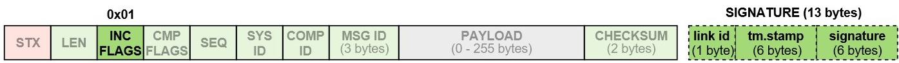

# 消息签名 (身份验证)

[MAVLink 2](../guide/mavlink_2.md) adds support for message signing, which allows a MAVLink system to verify that messages originate from a trusted source.

本主题提供消息签名的概述, 这对于使用现有 MAVLink 库的开发人员和新的 MAVLink 代码生成器的编写者都很有用。 它解释了系统如何确定报文是否已签名、签名是否有效、如何允许接受未签名的报文以及如何创建和共享用于创建签名的 <em>secret</em>。
It explains how a system can determine if a message is signed and whether the signature is valid, how to allow unsigned messages to be accepted, and how to create and share the _secret_ used to create the signature.

有关使用现有 mavlink 库的开发人员的更多详细信息, 请参见:

- [C Message Signing](../mavgen_c/message_signing_c.md) (mavgen)
- [Pymavlink Message Signing](../mavgen_python/index.md#message_signing) (mavgen)

<!-- Others?  -->

## 帧格式

For a signed packet the **0x01** bit of the [incompatibility flag field](../guide/mavlink_2.md#incompat_flags) is set true and an additional 13 bytes of "signature" data appended to the packet.
签名的数据包格式如下。



:::info
The [incompatibility flags](../guide/mavlink_2.md#incompat_flags) in the packet header are used to indicate that the MAVLink library must reject the packet if it does not understand or cannot handle the flag.
In other words, a MAVLink library that does not support signing must drop signed packets.
The C library uses [MAVLINK_IFLAG_SIGNED](../guide/mavlink_2.md#MAVLINK_IFLAG_SIGNED) to represent the "supports message signing" bit.
:::

签字的13字节为：

| 数据                                                                           | 描述                                                                                                                                                                          |
| ---------------------------------------------------------------------------- | --------------------------------------------------------------------------------------------------------------------------------------------------------------------------- |
| [linkID](#link_ids) (8&amp;nbsp;bits) | 发送数据包的链接ID。 通常与<em>channel</em>相同。 Normally this is the same as the _channel_.                                                                              |
| [timestamp](#timestamps) (48 bits)                        | 2015年1月1日GMT时间以来的10个微秒时间戳。 This _must_ monotonically increase for every message on a particular [link](#link_ids). 请注意，如果数据包平均每秒100,000多个数据包，那么时间戳可能早于实际时间。 |
| [signature](#signature) (48 bits)                         | 基于完整的数据包、时间戳和秘密密钥，数据包有48位签名。                                                                                                                                                |

见下文关于字段的更多信息。

### Link IDs {#link_ids}

提供了8位链接ID，以确保签名系统对多链接 MAVLink 系统足够强大。 每个执行都应该指定一个链接ID，指定它启用的 MAVLink 通信渠道，并将此ID置于链接ID字段中。 链接 ID 特别重要，因为不同链接（如WiFi，加上遥控无线电广播）之间可能存在巨大的潜在差异。
每个执行都应该指定一个链接ID，指定它启用的 MAVLink 通信渠道，并将此ID置于链接ID字段中。 链接 ID 特别重要，因为不同链接（如WiFi，加上遥控无线电广播）之间可能存在巨大的潜在差异。

The monotonically increasing [timestamp](#timestamp) rule is applied separately for each logical stream, where a stream is defined by the tuple:

```
(系统 id、组件 id、链接 id)
```

:::info
For more information see [C Message Signing > Handling Link IDs](../mavgen_c/message_signing_c.md#handling_link_ids).
:::

### Signature {#signature}

The 48 bit (6 byte) signature is the first 48 bits of a SHA-256 hash of the complete packet (without the signature, but including the timestamp) appended to the [secret key](#secret_key).
密钥是 MAVLink 通道（即自动试验、地面站或 MAVLink API）两个终端储存的二进制数据的32字节。

This is shown below, where `+` represents concatenation and `sha256_48()` is a sha256 implementation which returns the first 48 bits of the normal sha256 output:

```
signature = sha256_48(secret_key + header + payload + CRC + link-ID + timestamp)
```

## Timestamp Handling {#timestamp}

时间戳是48位，从2015年1月1日起，单位为10微秒。 对于1/1/1970年以来可用的系统（unexpoch），你可以在 14200004 秒内使用抵消。

:::info
This is a loose definition, as the various update mechanisms detailed below may result in the timestamp being significantly different from actual GMT time.
:::

All timestamps generated must be at least 1 more than the previous timestamp sent in the same session for the same link/`(SystemID, ComponentID, LinkID)` tuple.
如果数据包以每秒100 000多包的速度破裂，时间戳可能提前 GMT 时间。

MAVLink 启用的设备可能不知道当前的 GMT 时间，例如，如果没有可靠的时间源，或者，如果它刚刚启动，并且尚未从GPS 或其他系统中获得时间。

系统应当执行以下规则，以获得可靠的时间戳：

- 当前时间戳应定期储存在持久性储存中(最好至少每分钟一次)

- 启动时使用的时间戳应该是系统时钟和存储时间戳所隐含的时间戳的最大值

- 如果该系统没有一个 RTC 机制，则应当更新其在全球定位系统锁定时时的时间戳。 应该使用全球定位系统和存储时间戳的最大时间戳。 应该使用全球定位系统和存储时间戳的最大时间戳。

- 从特定链接发送的每个消息中，时间戳应增加一个。

- When a correctly signed message is decoded the timestamp should be replaced by the timestamp of the incoming message if that timestamp is greater than the current timestamp.

  ::: info
  The link timestamp must never be updated with the timestamp from an incorrectly signed packet (even if these are being [accepted](#accepting_incorrectly_signed_packets)).
  :::

- The timestamp on incoming signed messages should be checked against the previous timestamp for the incoming `(linkID,srcSystem,SrcComponent)` tuple and the message rejected if it is smaller.

- If there is no previous message with the given `(linkID,srcSystem,SrcComponent)` then the timestamp should be accepted if it not more than 6 million (one minute) behind the current timestamp.

:::tip
For devices that store the timestamp in persistent storage, implementations can prevent race conditions by storing two timestamp values.
在写入时, 应更新两个值中较小的值。 在读取时, 应使用两个值中较大的值。
:::

## Accepting Signed Packets {#accept_signed_packets}

当签名的数据包到达时, 如果出现以下情况, 则应将其丢弃:

- Timestamp is older than the previous packet from the same logical stream - where a logical stream is defined as the sequence of MAVLink packets with the same (`SystemID`, `ComponentID`, `LinkID`) tuple.
- 计算的48位签名与数据包中包含的签名不匹配。
- 时间戳在本地系统的时间戳后面超过 1分钟 (6, 000, 000)。

## Accepting Unsigned Packets {#accepting_unsigned_packets}

MAVLink libraries should provide a mechanism that allows a system to conditionally accept _unsigned_ packets.

接受这些数据包的规则将是特定于实现的, 但可以基于参数设置、传输类型、消息类型、(in) 兼容性标志等的组合。

:::info
All packets that do not meet the system-specific unsigned packet acceptance rules must be rejected (otherwise there is no benefit gained from signing/authentication).
:::

关于何时接受未签名数据包的一些建议:

- 接受基于系统特定参数的所有未签名数据包。
- 如果连接是通过 "安全通道" (例如本地 usb 电缆或本地有线以太网电缆), 则接受所有未签名的数据包。
- `RADIO_STATUS` packets are always accepted without signing (to make life easier for telemetry radios).
- 在 "无签名模式" (可能由启动时按下的硬件按钮触发) 时接受所有未签名的数据包。
- 接受所有未签名的数据包, 直到 (无条件地) 收到已签名的数据包, 然后移动到上面更受限制的签名规则。

## Accepting Incorrectly Signed Packets {#accepting_incorrectly_signed_packets}

MAVLink 库应该提供一种机制, 允许系统有条件地接受签名不正确的数据包。

此功能可能有助于查找带有损坏的密钥的失联飞机 (gcs 可以选择仍然显示位置信息, 尽管理想情况下使用不同的 "不受信任" 图标)。

:::info
A system that is accepting incorrectly signed packets should provide a highly conspicuous indication that the connection is _unsafe_/_insecure_. 格式错误的签名数据包表示配置错误、传输失败、协议失败或恶意操作。
:::

## Secret Key Management {#secret_key}

密钥是32字节的二进制数据, 用于创建可由密钥的其他持有者验证的消息签名。 密钥应在网络中的一个系统 (通常是 GCS) 上创建, 并通过安全通道共享到其他受信任的设备。 系统必须具有共享密钥才能进行通信。
密钥应在网络中的一个系统 (通常是 GCS) 上创建, 并通过安全通道共享到其他受信任的设备。
系统必须具有共享密钥才能进行通信。

:::info
The _mavgen_ [C](../mavgen_c/message_signing_c.md) and [Python](../mavgen_python/index.md#message_signing) libraries support only one key per link.
这是库的选择, 而不是协议的限制/要求。
相反, 实现可以存储一个密钥池, 并/或在每个连接的基础上管理密钥。
:::

密钥应存储在持久存储设备中, 并且不得通过任何可公开访问的通信协议公开。
密钥应存储在持久存储设备中, 并且不得通过任何可公开访问的通信协议公开。 特别是, 密钥不得在可以用于公共日志分析的 MAVLink 参数、MAVLink 日志文件或数据闪存日志文件中公开。

生成密钥的方法取决于实现。
例如, 它可以通过以下方式生成:

- 用户输入的字符串, 然后通过 sha-256 运行。
- 随机密钥生成器。

The secret key may be shared to other devices using the [SETUP_SIGNING](../messages/common.md#SETUP_SIGNING) message.
The message should only ever be sent over a secure link (e.g. USB or wired Ethernet) as a direct message to each connected `system_id`/`component_id`.
必须设置接收系统来处理消息, 并将接收到的密钥存储到相应的永久存储中。

The same secure method can be used to both _set_ and _reset_ a system's key (reseting a key does not have to be "more secure" than setting it in the first place).

The `SETUP_SIGNING` message should never be broadcast, and received `SETUP_SIGNING` messages must never be automatically forwarded to other active MAVLink devices/streams/channels.
这是为了避免通过安全链接 (如 usb) 收到的密钥通过不安全的链接 (例如 wifi) 自动转发到另一个系统的情况。

不通过 USB 提供 MAVLink 的自动驾驶仪可能会创建一个模块, 可以从命令行界面 (例如 nsh) 设置密钥。

:::tip
We recommend that GCS implementations should generate the secret key and share this with connected systems over a secure link (e.g. USB).
The receiving system may be configured to ignore message signatures on the secure channel (i.e. accept all [signed](#accept_signed_packets), [unsigned](#accepting_unsigned_packets) or [incorrectly signed](#accepting_incorrectly_signed_packets) packets), so that it is possible to reset a key that has been lost or corrupted.
:::

## 日志记录

In order to avoid leaking the secret key used for signing, systems should omit [SETUP_SIGNING](../messages/common.md#SETUP_SIGNING) messages from logs (or replace the secret with 32 0xFF bytes in the logged message).

Similarly, signed packets should have the signature [incompatibility bit](../guide/mavlink_2.md#incompat_flags) cleared and the signature block removed before being put into telemetry log files.
这使得潜在攻击者更难以收集大量签名数据来攻击系统。

## 更多信息

The [Message Signing Proposal](https://docs.google.com/document/d/1ETle6qQRcaNWAmpG2wz0oOpFKSF_bcTmYMQvtTGI8ns/edit?usp=sharing) contains additional information, including:

- 设计决定背后的原因。
- 评价安全效力，包括抵制重播和脱机攻击。
- 假设。

:::info
Much of this content is derived from the [Message Signing Proposal](https://docs.google.com/document/d/1ETle6qQRcaNWAmpG2wz0oOpFKSF_bcTmYMQvtTGI8ns/edit?usp=sharing) (Google Doc).
:::
