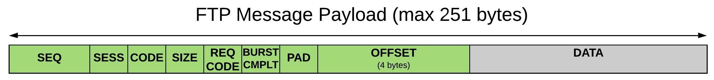

# File Transfer Protocol (FTP)

The FTP Protocol enables an FTP-like file transfer protocol over MAVLink. It supports common FTP operations like: reading, truncating, writing, removing and creating files, listing and removing directories.

The protocol follows a client-server pattern, where all commands are sent by the GCS (client), and the Drone (server) responds either with an ACK containing the requested information, or a NAK containing an error. The GCS sets a timeout after most commands, and may resend the command if it is triggered. The drone must re-send its response if a request with the same sequence number is received.

All messages (commands, ACK, NAK) are exchanged inside [FILE_TRANSFER_PROTOCOL](../messages/common.md#FILE_TRANSFER_PROTOCOL) messages. This message type definition is minimal, with fields for specifying the target network, system and component, and for an "arbitrary" variable-length payload.

The different commands and other information required to implement the protocol are encoded *within* in the `FILE_TRANSFER_PROTOCOL` payload. This topic explains the encoding, packing format, commands and errors, and the order in which the commands are sent to implement the core FTP functionality.

> **Note** The encoding and content of the payload field are not mandated by the specification - and can be extension specific. This topic covers the encoding that has been used by *QGroundControl* and PX4.

A MAVLink system that supports this protocol should also set the [MAV_PROTOCOL_CAPABILITY_FTP](../messages/common.md#MAV_PROTOCOL_CAPABILITY_FTP) flag in the [AUTOPILOT_VERSION.capability](../messages/common.md#AUTOPILOT_VERSION) field.

## Payload Format {#payload}

The `FILE_TRANSFER_PROTOCOL` payload is encoded with the information required for the various FTP messages. This includes fields for holding the command that is being sent, the sequence number of the current FTP message (for multi-message data transfers), the size of information in the data part of the message etc.

> **Tip** Readers will note that the FTP payload format is very similar to the packet format used for serializing MAVLink itself.

Below is the over-the-wire format for the payload part of the [FILE_TRANSFER_PROTOCOL](../messages/common.md#FILE_TRANSFER_PROTOCOL) message on PX4/*QGroundControl*.



| Byte Index      | C version                | Content                     | Value               | Explanation                                                                                                                                                                                                                                                                                                                                                                                             |
| --------------- | ------------------------ | --------------------------- | ------------------- | ------------------------------------------------------------------------------------------------------------------------------------------------------------------------------------------------------------------------------------------------------------------------------------------------------------------------------------------------------------------------------------------------------- |
| 0 to 1          | `uint16_t seq_number`    | Sequence number for message | 0&nbsp;-&nbsp;65535 | All *new* messages between the GCS and drone iterate this number. Re-sent commands/ACK/NAK should use the previous response's sequence number.                                                                                                                                                                                                                                                          |
| 2               | `uint8_t session`        | Session id                  | 0 - 255             | Session id for read/write operations (the server may use this to reference the file handle and information about the progress of read/write operations).                                                                                                                                                                                                                                                |
| 3               | `uint8_t opcode`         | [OpCode](#opcodes) (id)     | 0 - 255             | Ids for particular commands and ACK/NAK messages.                                                                                                                                                                                                                                                                                                                                                       |
| 4               | `uint8_t size`           | Size                        | 0 - 255             | Depends on [OpCode](#opcodes). For Reads/Writes this is the size of the `data` transported. For NAK it is the number of bytes used for [error information](#error_codes) (1 or 2).                                                                                                                                                                                                                      |
| 5               | `uint8_t req_opcode`     | Request [OpCode](#opcodes)  | 0 - 255             | OpCode (of original message) returned in an ACK or NAK response.                                                                                                                                                                                                                                                                                                                                        |
| 6               | `uint8_t burst_complete` | Burst complete              | 0, 1                | Code to indicate if a burst is complete. 1: set of burst packets complete, 0: More burst packets coming.  
- Only used if `req_opcode` is [BurstReadFile](#BurstReadFile).                                                                                                                                                                                                                              |
| 7               | `uint8_t padding`        | Padding                     |                     | 32 bit alignment padding.                                                                                                                                                                                                                                                                                                                                                                               |
| 8 to 11         | `uint32_t offset`        | Content offset              |                     | Offsets into data to be sent for [ListDirectory](#ListDirectory) and [ReadFile](#ReadFile) commands.                                                                                                                                                                                                                                                                                                    |
| 12 to (max) 251 | `uint8_t data[]`         | Data                        |                     | Command/response data. Varies by [OpCode](#opcodes). This contains the `path` for operations that act on a file or directory. For an ACK for a read or write this is the requested information. For an ACK for a `OpenFileRO` operation this is the size of the file that was opened. For a NAK the first byte is the [error code](#error_codes) and the (optional) second byte may be an error number. |

## OpCodes/Command {#opcodes}

The opcodes that may be sent by the GCS (client) to the drone (server) are listed below.

<!--  uint8_t enum Opcode: https://github.com/PX4/Firmware/blob/master/src/modules/mavlink/mavlink_ftp.h -->


| Opcode                        | Name                             | Description                                                                                                                                                                                                                                                                                                                                                                                                                                                                                                                                                                                                                                                           |
| ----------------------------- | -------------------------------- | --------------------------------------------------------------------------------------------------------------------------------------------------------------------------------------------------------------------------------------------------------------------------------------------------------------------------------------------------------------------------------------------------------------------------------------------------------------------------------------------------------------------------------------------------------------------------------------------------------------------------------------------------------------------- |
| 0                             | None                             | Ignored, always ACKed                                                                                                                                                                                                                                                                                                                                                                                                                                                                                                                                                                                                                                                 |
| <span id="TerminateSession"></span> 1   | TerminateSession                 | Terminates open Read `session`.  
- Closes the file associated with (`session`) and frees the session ID for re-use.                                                                                                                                                                                                                                                                                                                                                                                                                                                                                                                                                  |
| <span id="ResetSessions"></span> 2   | ResetSessions                    | Terminates *all* open read sessions.  
- Clears all state held by the drone (server); closes all open files, etc.  
- Sends an ACK reply with no data. <!-- Note, is same as Terminate, but does not check if file session exists -->                                                                                                                                                                                                                                                                                                                                                                                                                                 |
| <span id="ListDirectory"></span> 3   | [ListDirectory](#list_directory) | List directory entry information (files, folders etc.) in `<path>`, starting from a specified entry index (`<offset>`).  
- Response is an ACK packet with one or more entries on success, otherwise a NAK packet with an error code.  
- Completion is indicated by a NACK with EOF in response to a requested index (`offset`) beyond the list of entries.  
- The directory is closed after the operation, so this leaves no state on the server.                                                                                                                                                                                                      |
| <span id="OpenFileRO"></span> 4   | OpenFileRO                       | Opens file at `<path>` for reading, returns `<session>`  
- The `path` is stored in the [payload](#payload) `data`. The drone opens the file (`path`) and allocates a *session number*. The file must exist.  
- An ACK packet must include the allocated `session` and the data size of the file to be opened (`size`)  
- A NAK packet must contain [error information](#error_codes) . Typical error codes for this command are `NoSessionsAvailable`, `FileExists`.   
- The file remains open after the operation, and must eventually be closed by `Reset` or `Terminate`.                                                                          |
| <span id="ReadFile"></span> 5   | ReadFile                         | Reads `<size>` bytes from `<offset>` in `<session>`.  
- Seeks to (`offset`) in the file opened in (session) and reads (`size`) bytes into the result buffer.  
- Sends an ACK packet with the result buffer on success, otherwise a NAK packet with an error code. For short reads or reads beyond the end of a file, the (`size`) field in the ACK packet will indicate the actual number of bytes read.  
- Reads can be issued to any offset in the file for any number of bytes, so reconstructing portions of the file to deal with lost packets should be easy.  
- For best download performance, try to keep two `Read` packets in flight. |
| <span id="CreateFile"></span> 6   | CreateFile                       | Creates file at `<path>` for writing, returns `<session>`.  
- Creates the file (path) and allocates a *session number*. The file must not exist, but all parent directories must exist.  
- Sends an ACK packet with the allocated session number on success, or a NAK packet with an error code on error (i.e. [FileExists](#FileExists) if the `path` already exists).  
- The file remains open after the operation, and must eventually be closed by `Reset` or `Terminate`.                                                                                                                                                                         |
| <span id="WriteFile"></span> 7   | WriteFile                        | Writes `<size>` bytes to `<offset>` in `<session>`.  
- Sends an ACK reply with no data on success, otherwise a NAK packet with an error code.                                                                                                                                                                                                                                                                                                                                                                                                                                                                                                      |
| <span id="RemoveFile"></span> 8   | RemoveFile                       | Remove file at `<path>`.  
- ACK reply with no data on success.  
- NAK packet with [error information](#error_codes) on failure.                                                                                                                                                                                                                                                                                                                                                                                                                                                                                                                               |
| <span id="CreateDirectory"></span> 9   | CreateDirectory                  | Creates directory at `<path>`.  
- Sends an ACK reply with no data on success, otherwise a NAK packet with an error code.                                                                                                                                                                                                                                                                                                                                                                                                                                                                                                                                       |
| <span id="RemoveDirectory"></span> 10  | RemoveDirectory                  | Removes directory at `<path>`. The directory must be empty.   
- Sends an ACK reply with no data on success, otherwise a NAK packet with an error code.                                                                                                                                                                                                                                                                                                                                                                                                                                                                                                         |
| <span id="OpenFileWO"></span> 11 | OpenFileWO                       | Opens file at `<path>` for writing, returns `<session>`.   
- Opens the file (`path`) and allocates a *session number*. The file must exist.  
- Sends an ACK packet with the allocated *session number* on success, otherwise a NAK packet with an error code.  
- The file remains open after the operation, and must eventually be closed by `Reset` or `Terminate`.                                                                                                                                                                                                                                                                                   |
| <span id="TruncateFile"></span> 12 | TruncateFile                     | Truncate file at `<path>` to `<offset>` length.  
- Sends an ACK reply with no data on success, otherwise a NAK packet with an error code.                                                                                                                                                                                                                                                                                                                                                                                                                                                                                                                |
| <span id="Rename"></span> 13 | Rename                           | Rename `<path1>` to `<path2>`.  
- Sends an ACK reply the no data on success, otherwise a NAK packet with an error code (i.e. if the source path does not exist).                                                                                                                                                                                                                                                                                                                                                                                                                                                                                         |
| <span id="CalcFileCRC32"></span> 14 | CalcFileCRC32                    | Calculate CRC32 for file at `<path>`.  
- Sends an ACK reply with the checksum on success, otherwise a NAK packet with an error code.                                                                                                                                                                                                                                                                                                                                                                                                                                                                                                                           |
| <span id="BurstReadFile"></span> 15 | BurstReadFile                    | Burst download session file.                                                                                                                                                                                                                                                                                                                                                                                                                                                                                                                                                                                                                                          |

The drone (server) will respond with/send the following opcodes for any of the above messages (ACK response on success or a NAK in the event of an error).

| Opcode | Name | Description   |
| ------ | ---- | ------------- |
| 128    | ACK  | ACK response. |
| 129    | NAK  | NAK response. |

Notes:

- An ACK response may additionally return requested data in the payload (e.g. `OpenFileRO` returns the session and file size, `ReadFile` returns the requested file data, etc.). 
- The NAK response includes [error information](#error_codes) in the payload `data`. 

## NAK Error Information {#error_codes}

NAK responses must include one of the errors codes listed below in the [payload](#payload) `data[0]` field.

An appropriate error code must be used if one is defined. If no appropriate error code exists, the Drone (server) may respond with [Fail](#Fail) or [FailErrno](#FailErrno).

If the error code is `FailErrno`, then `data[1]` must additionally contain an error number. This error number is a file-system specific error code (understood by the server).

The payload `size` field must be set to either 1 or 2, depending on whether or not `FailErrno` is specified.

> **Note** These are **errors**. Normally if the GCS receives an error it should not attempt to continue the FTP operation, but instead return to an idle state.

<!--  uint8_t enum ErrorCode: https://github.com/PX4/Firmware/blob/master/src/modules/mavlink/mavlink_ftp.h -->

| Error                        | Name                | Description                                                                                                                                    |
| ---------------------------- | ------------------- | ---------------------------------------------------------------------------------------------------------------------------------------------- |
| <span id="None"></span>0  | None                | No error                                                                                                                                       |
| <span id="Fail"></span>1  | Fail                | Unknown failure                                                                                                                                |
| <span id="FailErrno"></span>2  | FailErrno           | Command failed, Err number sent back in `PayloadHeader.data[1]`. This is a file-system error number understood by the server operating system. |
| <span id="InvalidDataSize"></span>3  | InvalidDataSize     | Payload `size` is invalid                                                                                                                      |
| <span id="InvalidSession"></span>4  | InvalidSession      | Session is not currently open                                                                                                                  |
| <span id="NoSessionsAvailable"></span>5  | NoSessionsAvailable | All available sessions are already in use.                                                                                                     |
| <span id="EOF"></span>6  | EOF                 | Offset past end of file for `ListDirectory` and `ReadFile` commands.                                                                           |
| <span id="UnknownCommand"></span>7  | UnknownCommand      | Unknown command / opcode                                                                                                                       |
| <span id="FileExists"></span>8  | FileExists          | File/directory already exists                                                                                                                  |
| <span id="FileProtected"></span>9  | FileProtected       | File/directory is write protected                                                                                                              |
| <span id="FileNotFound"></span>10 | FileNotFound        | File/directory not found                                                                                                                       |

## Timeouts/Resending {#timeouts}

The GCS (client) starts a timeout after most commands are sent (these are cleared if an ACK/NAK is received).

> **Note** Timeouts may not be set for some messages. For example, a timeout need not set for [ResetSessions](#ResetSessions) as the message should always succeed.

If a timeout activates either the command or its response is assumed to have been lost, and the command should be re-sent with the same sequence number etc. A number of retries are allowed, after which the GCS should fail the whole download and reset to an idle state.

If the drone (client) receives a message with the same sequence number then it assumes that its ACK/NAK response was lost. In this case it should resend the response (the sequence number is not iterated, because it is as though the previous response was not sent).

The drone has no timeout mechanism; it only ever responds to commands and does not expect any responses.

GCS recommended settings:

- ACK/NAK timeout: 50 milliseconds
- Command retries: 6

## FTP Operations

### Reading a File

The sequence of operations for downloading (reading) a file, assuming there are no timeouts and all operations/requests succeed, is shown below.

[](https://mermaid-js.github.io/mermaid-live-editor/#/edit/eyJjb2RlIjoic2VxdWVuY2VEaWFncmFtO1xuICAgIHBhcnRpY2lwYW50IEdDU1xuICAgIHBhcnRpY2lwYW50IERyb25lXG4gICAgTm90ZSByaWdodCBvZiBHQ1M6IE9wZW4gZmlsZVxuICAgIEdDUy0-PkRyb25lOiAgT3BlbkZpbGVSTyggZGF0YVswXT1wYXRoLCBzaXplPWxlbihwYXRoKSApXG4gICAgRHJvbmUtLT4-R0NTOiBBQ0soIHNlc3Npb24sIHNpemU9NCwgZGF0YT1sZW4oZmlsZSkgKVxuICAgIE5vdGUgcmlnaHQgb2YgR0NTOiBSZWFkIGZpbGUgaW4gY2h1bmtzPGJyPihjYWxsIGF0IG9mZnNldClcbiAgICBHQ1MtPj5Ecm9uZTogIFJlYWRGaWxlKHNlc3Npb24sIHNpemUsIG9mZnNldClcbiAgICBEcm9uZS0tPj5HQ1M6IEFDSyhzZXNzaW9uLCBzaXplPWxlbihidWZmZXIpLCBkYXRhWzBdPWJ1ZmZlcilcbiAgICBOb3RlIHJpZ2h0IG9mIEdDUzogQ29udGludWUgdW50aWwgTkFLPGJyPiB3aXRoIEVPRlxuICAgIERyb25lLS0-PkdDUzogTkFLKHNlc3Npb24sIHNpemU9MSwgZGF0YT1FT0YpXG4gICAgTm90ZSByaWdodCBvZiBHQ1M6IENsb3NlIHNlc3Npb25cbiAgICBHQ1MtPj5Ecm9uZTogIFRlcm1pbmF0ZVNlc3Npb24oc2Vzc2lvbilcbiAgICBEcm9uZS0tPj5HQ1M6IEFDSygpIiwibWVybWFpZCI6eyJ0aGVtZSI6ImRlZmF1bHQifSwidXBkYXRlRWRpdG9yIjpmYWxzZX0)

<!-- Original diagram
sequenceDiagram;
    participant GCS
    participant Drone
    Note right of GCS: Open file
    GCS->>Drone:  OpenFileRO( data[0]=path, size=len(path) )
    Drone-- >>GCS: ACK( session, size=4, data=len(file) )
    Note right of GCS: Read file in chunks<br>(call at offset)
    GCS->>Drone:  ReadFile(session, size, offset)
    Drone-- >>GCS: ACK(session, size=len(buffer), data[0]=buffer)
    Note right of GCS: Continue until NAK<br> with EOF
    Drone-- >>GCS: NAK(session, size=1, data=EOF)
    Note right of GCS: Close session
    GCS->>Drone:  TerminateSession(session)
    Drone-- >>GCS: ACK()
-->

The sequence of operations is:

1. GCS (client) sends [OpenFileRO](#OpenFileRO) command specifying the file path to open. 
    - The payload must specify: `data[0]`= file path string, `size`=length of file path string.
2. Drone (server) responds with either 
    - ACK on success. The [payload](#payload) must specify fields: `session` = file session id, `size` = 4, `data` = length of file that has been opened. 
    - NAK with [error information](#error_codes), e.g. `NoSessionsAvailable`, `FileExists`. The GCS may cancel the operation, depending on the error.
3. GCS sends [ReadFile](#ReadFile) commands to download a chunk of data from the file. 
    - The payload must specify: `session`=current session, `size`=size of data to read, `offset`= position in data to start reading
4. Drone responds to each message with either 
    - ACK on success. The [payload](#payload) fields are: `data` = data chunk requested, `size` = size of data in the `data` field.
    - NAK on failure with [error information](#error_codes).
5. The ReadFile/ACK sequence above is repeated at different offsets to download the whole file. 
    - Eventually the GCS will (must) request an offset past the end of the file. 
    - The Drone will return a NAK with error code EOF. The GCS uses this message to recognise the download is complete.
6. GCS sends [TerminateSession](#TerminateSession) to close the file. The drone should send an ACK/NAK, but this may (generally speaking) be ignored by the GCS.

The GSC should create a timeout after `OpenFileRO` and `ReadFile` commands are sent and resend the messages as needed (and [described above](#timeouts)). A timeout is not set for `TerminateSession` (the server may ignore failure of the command or the ACK).

### Uploading a File

The sequence of operations for uploading a file to the drone, assuming there are no timeouts and all operations/requests succeed, is shown below.

[](https://mermaid-js.github.io/mermaid-live-editor/#/edit/eyJjb2RlIjoic2VxdWVuY2VEaWFncmFtO1xuICAgIHBhcnRpY2lwYW50IEdDU1xuICAgIHBhcnRpY2lwYW50IERyb25lXG4gICAgTm90ZSByaWdodCBvZiBHQ1M6IENyZWF0ZSBmaWxlIG9uIERyb25lXG4gICAgR0NTLT4-RHJvbmU6ICBDcmVhdGVGaWxlKCBkYXRhWzBdPXBhdGgsIHNpemU9bGVuKHBhdGgpIClcbiAgICBEcm9uZS0tPj5HQ1M6IEFDSyggc2Vzc2lvbiAsIHNpemU9MCApXG4gICAgTm90ZSByaWdodCBvZiBHQ1M6IFdyaXRlIGRhdGEgaW4gY2h1bmtzPGJyPnVudGlsIGNvbXBsZXRlXG4gICAgR0NTLT4-RHJvbmU6ICBXcml0ZUZpbGUoc2Vzc2lvbiwgc2l6ZT1sZW4oYnVmZmVyKSwgb2Zmc2V0LCBkYXRhPWJ1ZmZlcilcbiAgICBEcm9uZS0tPj5HQ1M6IEFDSyggc2Vzc2lvbiwgc2l6ZT0wIClcbiAgICBOb3RlIHJpZ2h0IG9mIEdDUzogQ2xvc2Ugc2Vzc2lvblxuICAgIEdDUy0-PkRyb25lOiAgVGVybWluYXRlU2Vzc2lvbihzZXNzaW9uKVxuICAgIERyb25lLS0-PkdDUzogQUNLKCkiLCJtZXJtYWlkIjp7InRoZW1lIjoiZGVmYXVsdCJ9LCJ1cGRhdGVFZGl0b3IiOmZhbHNlfQ)

<!-- Original Sequence
sequenceDiagram;
    participant GCS
    participant Drone
    Note right of GCS: Create file on Drone
    GCS->>Drone:  CreateFile( data[0]=path, size=len(path) )
    Drone-- >>GCS: ACK( session , size=0 )
    Note right of GCS: Write data in chunks<br>until complete
    GCS->>Drone:  WriteFile(session, size=len(buffer), offset, data=buffer)
    Drone-- >>GCS: ACK( session, size=0 )
    Note right of GCS: Close session
    GCS->>Drone:  TerminateSession(session)
    Drone-- >>GCS: ACK()
-->

The sequence of operations is:

1. GCS (client) sends [CreateFile](#CreateFile) command specifying the file path where the file is to be uploaded. 
    - The payload must specify: `data[0]`= target file path string, `size`=length of file path string.
2. Drone (server) attempts to create the file, and responds with either 
    - ACK on success. The [payload](#payload) must specify fields: `session` = new file session id, `size` = 0. 
    - NAK with [error information](#error_codes). 
        - The GCS should cancel the whole operation on error.
        - If there is a sequence error at this stage the GCS should send a command to `ResetSessions`
3. GCS sends [WriteFile](#WriteFile) commands to upload a chunk of data to the Drone. 
    - The payload must specify: `session`=current session id, `data`=file chunk,`size`=length of `data`, `offset`= offset of data to write
4. Drone responds to each message with either 
    - ACK on success. The [payload](#payload) fields are: `size` = 0.
    - NAK on failure with [error information](#error_codes). 
        - The GCS should cancel the whole upload operation by sending a command to `ResetSessions` if there is an NAK.
5. The WriteFile/ACK sequence above is repeated at different offsets to upload the whole file. Once the GCS determines that the upload is complete it moves to the next step.
6. GCS sends [TerminateSession](#TerminateSession) to close the file. The drone should send an ACK/NAK, but this may (generally speaking) be ignored by the GCS.

The GSC should create a timeout after `CreateFile` and `WriteFile` commands are sent, and resend the messages as needed (and [described above](#timeouts)). A timeout is not set for `TerminateSession` (the server may ignore failure of the command or the ACK).

> **Warning** PX4 and *QGroundControl* implement this slightly differently than outlined above. The implementation only has a single session (id=0) so only a single operation can be active at a time. As a result, this operation should only be started if no other operation is active. The drone expects that the session id will be set to zero by the sender of `CreateFile`. Last of all, the GCS sends `ResetSessions` rather than `TerminateSession`. While you can send either if talking to PX4, if the protocol is implemented elsewhere calling `ResetSessions` may break other communications.

### Remove File

> **Note** `RemoveFile` handling is implemented in PX4 but not in *QGroundControl*. GCS behaviour is therefore not fully defined/tested.

The sequence of operations for removing a file is shown below (assuming there are no timeouts and all operations/requests succeed).

[](https://mermaid-js.github.io/mermaid-live-editor/#/edit/eyJjb2RlIjoic2VxdWVuY2VEaWFncmFtO1xuICAgIHBhcnRpY2lwYW50IEdDU1xuICAgIHBhcnRpY2lwYW50IERyb25lXG4gICAgR0NTLT4-RHJvbmU6ICBSZW1vdmVGaWxlKCBkYXRhWzBdPXBhdGgsIHNpemU9bGVuKHBhdGgpIClcbiAgICBEcm9uZS0tPj5HQ1M6IEFDSyhzaXplPTApIiwibWVybWFpZCI6eyJ0aGVtZSI6ImRlZmF1bHQifSwidXBkYXRlRWRpdG9yIjpmYWxzZX0)

<!-- Original Sequence
sequenceDiagram;
    participant GCS
    participant Drone
    GCS->>Drone:  RemoveFile( data[0]=path, size=len(path) )
    Drone-- >>GCS: ACK(size=0)
-->

The sequence of operations is:

1. GCS sends [RemoveFile](#RemoveFile) command specifying the full path of the file to be deleted. 
    - The payload must specify: `data[0]`= file path string, `size`=length of file path string.
2. Drone attempts to delete file, and responds to the message with either: 
    - ACK on success, containing payload `size`=0 (i.e. no data).
    - NAK on failure, with [error information](#error_codes).
    - The drone must clean up any resources associated with the request after sending the response.

The GSC should create a timeout after the `RemoveFile` command is sent and resend the message as needed (and [described above](#timeouts)).

### Truncate File

The sequence of operations for truncating a file is shown below (assuming there are no timeouts and all operations/requests succeed).

> **Note** `TruncateFile` handling is implemented in PX4 but not in *QGroundControl*. GCS behaviour is therefore not fully defined/tested.

[](https://mermaid-js.github.io/mermaid-live-editor/#/edit/eyJjb2RlIjoic2VxdWVuY2VEaWFncmFtO1xuICAgIHBhcnRpY2lwYW50IEdDU1xuICAgIHBhcnRpY2lwYW50IERyb25lXG4gICAgR0NTLT4-RHJvbmU6ICBUcnVuY2F0ZUZpbGUgPGJyPiggZGF0YVswXT1wYXRoLCBzaXplPWxlbihwYXRoKSwgb2Zmc2V0PW9mZnNldCB0byB0cnVuY2F0ZSApXG4gICAgRHJvbmUtLT4-R0NTOiBBQ0soc2l6ZT0wKSIsIm1lcm1haWQiOnsidGhlbWUiOiJkZWZhdWx0In0sInVwZGF0ZUVkaXRvciI6ZmFsc2V9)

<!-- Original sequnce
sequenceDiagram;
    participant GCS
    participant Drone
    GCS->>Drone:  TruncateFile ( data[0]=path, size=len(path), offset=offset to truncate )
    Drone-- >>GCS: ACK(size=0)
-->

The sequence of operations is:

1. GCS sends [TruncateFile](#TruncateFile) command specifying file to truncate and the offset for truncation. 
    - The payload must specify: `data[0]`= file path string, `size` = length of file path string, `offset` = truncation point in file (amount of data to keep).
2. Drone attempts to truncate file, and responds to the message with either: 
    - ACK on success, containing payload `size`=0 (i.e. no data). 
        - The request should succeed if the offset is the same as the file size, and may be attempted if the offset is zero (i.e. truncate whole file).
    - NAK on failure, with [error information](#error_codes). 
        - The request should fail if the offset is 0 (truncate whole file) and for normal file system errors.
    - The drone must clean up any resources associated with the request after sending the response.

The GSC should create a timeout after the `TruncateFile` command is sent and resend the message as needed (and [described above](#timeouts)).

### List Directory {#list_directory}

The sequence of operations for getting a directory listing is shown below (assuming there are no timeouts and all operations/requests succeed).

[![Mermaid Sequence: List Directory](https://mermaid.ink/img/eyJjb2RlIjoic2VxdWVuY2VEaWFncmFtO1xuICAgIHBhcnRpY2lwYW50IEdDU1xuICAgIHBhcnRpY2lwYW50IERyb25lXG4gICAgTm90ZSBvdmVyIEdDUyxEcm9uZTogUmVxdWVzdCBlbnRyaWVzIGZyb20gaW5kZXggKG9mZnNldCkgMC48YnI-T25lIG9yIG1vcmUgZW50cmllcyByZXR1cm5lZCBpbiBBQ0suXG4gICAgR0NTLT4-RHJvbmU6IExpc3REaXJlY3RvcnkoIGRhdGFbMF09cGF0aCwgc2l6ZT1sZW4ocGF0aCksIG9mZnNldD0wIClcbiAgICBEcm9uZS0-PkdDUzogQUNLKHNpemUsIGRhdGE9ZW50cmllc19hdF9vZmZzZXRfMClcbiAgICBOb3RlIG92ZXIgR0NTLERyb25lOiBSZXBlYXQgcmVxdWVzdCBpbiBjeWNsZSB0byBnZXQgYWxsPGJyPmVudHJpZXMgKGVhY2ggdGltZSBzZXQgb2Zmc2V0IHRvPGJyPmVudHJ5IGluZGV4IGp1c3QgYWZ0ZXIgbGFzdCBvbmU8YnI-cmVjZWl2ZWQpLlxuICAgIEdDUy0-PkRyb25lOiBMaXN0RGlyZWN0b3J5KCBkYXRhWzBdPXBhdGgsIHNpemU9bGVuKHBhdGgpLCBvZmZzZXQ9Li4uKVxuICAgIERyb25lLT4-R0NTOiBBQ0soc2l6ZSwgZGF0YT1lbnRyaWVzX2F0X29mZnNldClcbiAgICBOb3RlIG92ZXIgR0NTLERyb25lOiBEcm9uZSBOQUNLIHdpdGggRU9GIHdoZW4gYWxsPGJyPmVudHJpZXMgcmV0dXJuZWQ8YnI-KGUuZy4gcmVxdWVzdCB3aXRoOjxicj5vZmZzZXQgPj0gbnVtYmVyIG9mIGVudHJpZXMpLlxuICAgIEdDUy0-PkRyb25lOiAgTGlzdERpcmVjdG9yeSggZGF0YVswXT1wYXRoLCBzaXplPWxlbihwYXRoKSwgb2Zmc2V0PXRvb19iaWcgKVxuICAgIERyb25lLT4-R0NTOiBOQUNLKHNpemU9MSwgZGF0YVswXT1FT0YpIiwibWVybWFpZCI6eyJ0aGVtZSI6ImRlZmF1bHQifSwidXBkYXRlRWRpdG9yIjpmYWxzZX0)](https://mermaid-js.github.io/mermaid-live-editor/#/edit/eyJjb2RlIjoic2VxdWVuY2VEaWFncmFtO1xuICAgIHBhcnRpY2lwYW50IEdDU1xuICAgIHBhcnRpY2lwYW50IERyb25lXG4gICAgTm90ZSBvdmVyIEdDUyxEcm9uZTogUmVxdWVzdCBlbnRyaWVzIGZyb20gaW5kZXggKG9mZnNldCkgMC48YnI-T25lIG9yIG1vcmUgZW50cmllcyByZXR1cm5lZCBpbiBBQ0suXG4gICAgR0NTLT4-RHJvbmU6IExpc3REaXJlY3RvcnkoIGRhdGFbMF09cGF0aCwgc2l6ZT1sZW4ocGF0aCksIG9mZnNldD0wIClcbiAgICBEcm9uZS0-PkdDUzogQUNLKHNpemUsIGRhdGE9ZW50cmllc19hdF9vZmZzZXRfMClcbiAgICBOb3RlIG92ZXIgR0NTLERyb25lOiBSZXBlYXQgcmVxdWVzdCBpbiBjeWNsZSB0byBnZXQgYWxsPGJyPmVudHJpZXMgKGVhY2ggdGltZSBzZXQgb2Zmc2V0IHRvPGJyPmVudHJ5IGluZGV4IGp1c3QgYWZ0ZXIgbGFzdCBvbmU8YnI-cmVjZWl2ZWQpLlxuICAgIEdDUy0-PkRyb25lOiBMaXN0RGlyZWN0b3J5KCBkYXRhWzBdPXBhdGgsIHNpemU9bGVuKHBhdGgpLCBvZmZzZXQ9Li4uKVxuICAgIERyb25lLT4-R0NTOiBBQ0soc2l6ZSwgZGF0YT1lbnRyaWVzX2F0X29mZnNldClcbiAgICBOb3RlIG92ZXIgR0NTLERyb25lOiBEcm9uZSBOQUNLIHdpdGggRU9GIHdoZW4gYWxsPGJyPmVudHJpZXMgcmV0dXJuZWQ8YnI-KGUuZy4gcmVxdWVzdCB3aXRoOjxicj5vZmZzZXQgPj0gbnVtYmVyIG9mIGVudHJpZXMpLlxuICAgIEdDUy0-PkRyb25lOiAgTGlzdERpcmVjdG9yeSggZGF0YVswXT1wYXRoLCBzaXplPWxlbihwYXRoKSwgb2Zmc2V0PXRvb19iaWcgKVxuICAgIERyb25lLT4-R0NTOiBOQUNLKHNpemU9MSwgZGF0YVswXT1FT0YpIiwibWVybWFpZCI6eyJ0aGVtZSI6ImRlZmF1bHQifSwidXBkYXRlRWRpdG9yIjpmYWxzZX0)

<!-- original sequence
sequenceDiagram;
    participant GCS
    participant Drone
    Note over GCS,Drone: Request entries from index (offset) 0.<br>One or more entries returned in ACK.
    GCS->>Drone: ListDirectory( data[0]=path, size=len(path), offset=0 )
    Drone->>GCS: ACK(size, data=entries_at_offset_0)
    Note over GCS,Drone: Repeat request in cycle to get all<br>entries (each time set offset to<br>entry index just after last one<br>received).
    GCS->>Drone: ListDirectory( data[0]=path, size=len(path), offset=...)
    Drone->>GCS: ACK(size, data=entries_at_offset)
    Note over GCS,Drone: Drone NACK with EOF when all<br>entries returned<br>(e.g. request with:<br>offset >= number of entries).
    GCS->>Drone:  ListDirectory( data[0]=path, size=len(path), offset=too_big )
    Drone->>GCS: NACK(size=1, data[0]=EOF)
-->

The sequence of operations is:

1. GCS sends [ListDirectory](#ListDirectory) command specifying a directory path and the **index** of an entry. 
    - The [payload](#payload) must specify: 
        - `data[0]` = file path
        - `size` = length of path string
        - `offset` = The index of the first entry to get (0 for first entry, 1 for second, etc.).
2. Drone responds with an ACK containing **one or more entries** (the first entry is the one specified in request `offset` field). 
    - The payload must specify: 
        - `data[0]` = Information for one or more (sequential) entries, starting at the requested entry index (`offset`). Each entry is separated with a null terminator (`\0`), and has the following format (where `type` is one of the letters **F**(ile), **D**(irectory), **S**(skip)) ```<type><file_or_folder_name>\t<file_size_in_bytes>\0``` For example, given five files named *TestFile1.xml* to *TestFile5.xml*, the entries returned at offset 2 might look like: `FTestFile3.xml\t223\0FTestFile4.xml\t755568\0FTestFile5.xml\t11111\0`
        - `size` = The size of the `data`.
3. The operation is then repeated at different offsets to download the whole directory listing. > **Note** The offset for each request will depend on how many entries were returned by the previous request(s).
4. The operation completes when the GCS requests an entry index (`offset`) greater than or equal to the number of entries. In this case the drone responds with a [NAK](#error_codes) containing [EOF](#EOF) (end of file).

The GSC should create a timeout after the `ListDirectory` command is sent and resend the message as needed (and [described above](#timeouts)).

The drone may also [NAK](#error_codes) with an unexpected error. Generally errors are unrecoverable, and the drone must clean up all resources (i.e. close file handles) associated with the request after sending the NAK.

### Create Directory

The sequence of operations for creating a directory is shown below (assuming there are no timeouts and all operations/requests succeed). Note that this operation will fail if the directory is not empty.

[](https://mermaid-js.github.io/mermaid-live-editor/#/edit/eyJjb2RlIjoic2VxdWVuY2VEaWFncmFtO1xuICAgIHBhcnRpY2lwYW50IEdDU1xuICAgIHBhcnRpY2lwYW50IERyb25lXG4gICAgR0NTLT4-RHJvbmU6ICBDcmVhdGVEaXJlY3RvcnkoIGRhdGFbMF09cGF0aCwgc2l6ZT1sZW4ocGF0aCkgKVxuICAgIERyb25lLS0-PkdDUzogQUNLKHNpemU9MCkiLCJtZXJtYWlkIjp7InRoZW1lIjoiZGVmYXVsdCJ9LCJ1cGRhdGVFZGl0b3IiOmZhbHNlfQ)

<!--
sequenceDiagram;
    participant GCS
    participant Drone
    GCS->>Drone:  CreateDirectory( data[0]=path, size=len(path) )
    Drone-- >>GCS: ACK(size=0)
-->

The sequence of operations is:

1. GCS sends [CreateDirectory](#CreateDirectory) command specifying the full path of the directory to be created. 
    - The payload must specify: `data[0]`= directory path string, `size`=length of directory path string.
2. Drone attempts to create directory, and responds to the message with either: 
    - ACK on success, containing payload `size`=0 (i.e. no data).
    - NAK on failure, with [error information](#error_codes).
    - The drone must clean up any resources associated with the request after sending the response.

The GSC should not create timeouts or handle the NAK case (other than to report an error to the user).

### Remove Directory

> **Note** `RemoveDirectory` handling is implemented in PX4 but not in *QGroundControl*. GCS behaviour is therefore not fully defined/tested.

The sequence of operations for removing a directory is shown below (assuming there are no timeouts and all operations/requests succeed). Note that this operation will fail if the directory is not empty.

[](https://mermaid-js.github.io/mermaid-live-editor/#/edit/eyJjb2RlIjoic2VxdWVuY2VEaWFncmFtO1xuICAgIHBhcnRpY2lwYW50IEdDU1xuICAgIHBhcnRpY2lwYW50IERyb25lXG4gICAgR0NTLT4-RHJvbmU6ICBSZW1vdmVEaXJlY3RvcnkoIGRhdGFbMF09cGF0aCwgc2l6ZT1sZW4ocGF0aCkgKVxuICAgIERyb25lLS0-PkdDUzogQUNLKHNpemU9MCkiLCJtZXJtYWlkIjp7InRoZW1lIjoiZGVmYXVsdCJ9LCJ1cGRhdGVFZGl0b3IiOmZhbHNlfQ)

<!-- Original Diagram
sequenceDiagram;
    participant GCS
    participant Drone
    GCS->>Drone:  RemoveDirectory( data[0]=path, size=len(path) )
    Drone-- >>GCS: ACK(size=0)
-->

The sequence of operations is:

1. GCS sends [RemoveDirectory](#RemoveDirectory) command specifying the full path of the directory to be deleted. 
    - The payload must specify: `data[0]`= directory path string, `size`=length of directory path string.
2. Drone attempts to delete directory, and responds to the message with either: 
    - ACK on success, containing payload `size`=0 (i.e. no data).
    - NAK on failure, with [error information](#error_codes).
    - The drone must clean up any resources associated with the request after sending the response.

The GSC should create a timeout after the `RemoveDirectory` command is sent and resend the message as needed (and [described above](#timeouts)).

### Burst Read File

TBD

<!-- Not clear how this is kicked off by QGC.
https://github.com/mavlink/qgroundcontrol/blob/master/src/uas/FileManager.cc#L579 
streamPath() calls 
_downloadWorker(from, downloadDir, false /* stream file */); - false means stream file


kCmdOpenFileRO

  - in _openAckResponse with opp kCOOpenBurst - change operation to kCOBurst
  - new session! This is the burst session.
  Set kCmdBurstReadFile 
  
  Ends when we hit EOF
  kCmdBurstReadFile
  
-->

## C Implementation

The FTP Protocol has been implemented (minimally) in C by PX4 <!-- and ArduPilot Flight Stacks, --> and 

*QGroundControl*.  
This implementation can be used in your own code within the terms of their software licenses.

PX4 Implementation:

- [src/modules/mavlink/mavlink_ftp.cpp](https://github.com/PX4/Firmware/blob/master/src/modules/mavlink/mavlink_ftp.cpp)
- [src/modules/mavlink/mavlink_ftp.h](https://github.com/PX4/Firmware/blob/master/src/modules/mavlink/mavlink_ftp.h)

*QGroundControl* implementation:

- [src/uas/FileManager.cc](https://github.com/mavlink/qgroundcontrol/blob/master/src/Vehicle/FTPManager.cc)
- [/src/uas/FileManager.h](https://github.com/mavlink/qgroundcontrol/blob/master/src/Vehicle/FTPManager.h)

Everything is run by the master (QGC in this case); the slave simply responds to packets in order as they arrive. There’s buffering in the server for a little overlap (two packets in the queue at a time). This is a tradeoff between memory and link latency which may need to be reconsidered at some point.

The MAVLink receiver thread copies an incoming request verbatim from the MAVLink buffer into a request queue, and queues a low-priority work item to handle the packet. This avoids trying to do file I/O on the MAVLink receiver thread, as well as avoiding yet another worker thread. The worker is responsible for directly queuing replies, which are sent with the same sequence number as the request.

The implementation on PX4 only supports a single session.

## CRC32 Implementation

The CRC32 calculation used by MAVLink FTP is similar to the ISO 3309 standard based on the polygon 0x04C11DB7. This is also referred to the CRC32 based on Gary Brown's work.

The difference of the MAVLink implementation versus the standard are:

- Start at 0 instead of `0xFFFFFFFF`.
- Missing final XOR out operation with `0xFFFFFFFF`.

The effects of the initial value and final XOR operation are documented in this [brief tutorial on CRC computation of the Linux kernel](https://github.com/torvalds/linux/blob/master/Documentation/staging/crc32.rst).