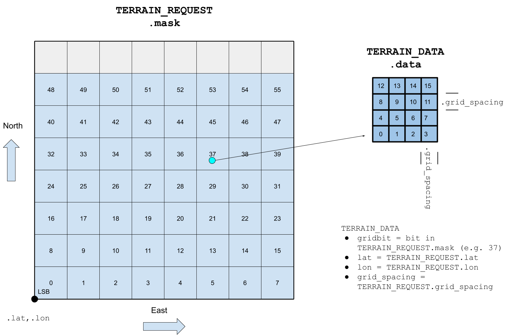

# Terrain Protocol

The *Terrain Protocol* provides a mechanism for a vehicle to get terrain information (tiles) from a ground station, and for a ground station to check the autopilot terrain cache for a tile at a particular location.

Support for this protocol is indicated by `AUTOPILOT_VERSION.capabilities` by the [MAV_PROTOCOL_CAPABILITY_TERRAIN](../messages/common.md#MAV_PROTOCOL_CAPABILITY_TERRAIN) flag.

> **Note** A vehicle that supports this capability must also support terrain following in missions using the data. Note however that a vehicle may also support terrain handling in missions using a distance sensor, even if this protocol is not supported and capability flag is not set.

## Message/Enum Summary

| Message                                                                                      | Description                                                                                                                                                                                                                                                                                                                 |
| -------------------------------------------------------------------------------------------- | --------------------------------------------------------------------------------------------------------------------------------------------------------------------------------------------------------------------------------------------------------------------------------------------------------------------------- |
| !!crwdBlockTags_23_sgaTkcolBdwrc! | Request from drone (to GCS) for terrain data. The message specifies a mask indicating what tiles are required, and the GCS responds by sending [TERRAIN_DATA](#TERRAIN_DATA) for each tile. The drone will also stream [TERRAIN_REPORT](#TERRAIN_REPORT) messages to provide progress updates while it is waiting for data. |
| !!crwdBlockTags_24_sgaTkcolBdwrc!       | Terrain data from GCS for a particular tile (sent in response to a [TERRAIN_REQUEST](#TERRAIN_REQUEST)). The `lat`/`lon` and `grid_spacing` must be the same as the `lat`/`lon` from a [TERRAIN_REQUEST](#TERRAIN_REQUEST).                                                                                                 |
| !!crwdBlockTags_25_sgaTkcolBdwrc!   | The drone will stream `TERRAIN_REPORT` to indicate progress of terrain download, and in response to a [TERRAIN_CHECK](#TERRAIN_CHECK).                                                                                                                                                                                      |
| !!crwdBlockTags_26_sgaTkcolBdwrc!     | Request that the vehicle report terrain height at the given location (expected response is a [TERRAIN_REPORT](#TERRAIN_REPORT)). Used by GCS to check if vehicle has all terrain data needed for a mission.                                                                                                                 |

## Sequences

### Autopilot Terrain Map Request

The sequence for a drone to update its terrain altitude information is entirely driven by the drone, and is shown below.

[](https://mermaid-js.github.io/mermaid-live-editor/#/edit/eyJjb2RlIjoic2VxdWVuY2VEaWFncmFtO1xuICAgIHBhcnRpY2lwYW50IERyb25lXG4gICAgcGFydGljaXBhbnQgR0NTXG4gICAgRHJvbmUtPj5HQ1M6IFRFUlJBSU5fUkVRVUVTVChtYXNrKVxuICAgIERyb25lLT4-RHJvbmU6IFN0YXJ0IHRpbWVvdXRcbiAgICBOb3RlIG92ZXIgRHJvbmUsIEdDUzogVEVSUkFJTl9EQVRBIGZvciBldmVyeSBiaXQgc2V0IGluIFRFUlJBSU5fUkVRVUVTVC5tYXNrXG4gICAgTm90ZSBvdmVyIERyb25lLCBHQ1M6IFRFUlJBSU5fUkVQT1JUIHN0cmVhbWVkIGFzIHByb2dyZXNzIHVwZGF0ZVxuICAgIEdDUy0-PkRyb25lOiBURVJSQUlOX0RBVEFcbiAgICBHQ1MtPj5Ecm9uZTogVEVSUkFJTl9EQVRBXG4gICAgRHJvbmUtPj5HQ1M6IFRFUlJBSU5fUkVQT1JUXG4gICAgR0NTLT4-RHJvbmU6IFRFUlJBSU5fREFUQVxuXG4gICAgRHJvbmUtPj5HQ1M6IFRFUlJBSU5fUkVQT1JUXG4gICAgTm90ZSBvdmVyIERyb25lLCBHQ1M6IERyb25lIHJlcXVlc3RzIG5ldyBtYXNrIGZvciBtaXNzaW5nIHRpbGVzIChldGMpXG4gICAgRHJvbmUtPj5HQ1M6IFRFUlJBSU5fUkVRVUVTVChtYXNrKVxuIiwibWVybWFpZCI6eyJ0aGVtZSI6ImRlZmF1bHQifSwidXBkYXRlRWRpdG9yIjpmYWxzZX0)

In summary, the sequence is:
1. Drone sends [TERRAIN_REQUEST](#TERRAIN_REQUEST) to the GCS to request a set of tiles (specified in a mask).
1. The GCS responds by sending a [TERRAIN_DATA](#TERRAIN_DATA) for each tile set in the mask
1. The drone also streams [TERRAIN_REPORT](#TERRAIN_REPORT) messages back to the GCS indicating the current state of the download
   - `TERRAIN_REPORT.pending` and `TERRAIN_REPORT.loaded` indicate how many tiles are expected and have arrived, respectively.
   - `TERRAIN_REPORT.lat`, `.lon`, .`terrain_height`, while duplicated in other messages, are useful for debugging (a GCS can check its own internal terrain data against what the information).
1. The drone must maintain its own record of what tiles have arrived/not arrived, and can re-request any that are missing using a further [TERRAIN_REQUEST](#TERRAIN_REQUEST) (with mask indicating just the missing tiles)

The diagram below shows the way the data is encoded within the [TERRAIN_REQUEST](#TERRAIN_REQUEST) and [TERRAIN_DATA](#TERRAIN_DATA).

<!-- Link to image source: https://docs.google.com/drawings/d/1DnDH6L58qBMW4HuCjMo3Fpkgx_vTYuwLAsH0W8bWLXQ/edit?usp=sharing -->

[TERRAIN_REQUEST.mask](#TERRAIN_REQUEST) is a 64-bit value that represents a row major 8x7 array of (4x4) tiles. The the `lat`, `lon` fields indicate the position of the South-West corner of first grid position (tile). The tiles are allocated sequentially in rows (West to East) starting from the lowest significant bit of `mask`, and then in columns (South to North).

Each tile represents a 4x4 grid of altitude information. The spacing between the rows/columns in the tile is indicated by `grid_spacing` (the same value must be used in both request and data messages).

### GCS Terrain Tile Check

The sequence for a GCS to check the autopilot terrain cache at a particular location is shown below.

[![](https://mermaid.ink/img/eyJjb2RlIjoic2VxdWVuY2VEaWFncmFtO1xuICAgIHBhcnRpY2lwYW50IEdDU1xuICAgIHBhcnRpY2lwYW50IERyb25lXG5cbiAgICBHQ1MtPj5Ecm9uZTogVEVSUkFJTl9DSEVDSyhsYXQsIGxvbilcbiAgICBEcm9uZS0-PkdDUzogVEVSUkFJTl9SRVBPUlRcbiAgICBOb3RlIG92ZXIgRHJvbmUsIEdDUzogVXNlIHJlc3VsdCBpZiBjaGVjayBhbmQgcmVwb3J0IGxhdC9sb24gbWF0Y2hcblxuIiwibWVybWFpZCI6eyJ0aGVtZSI6ImRlZmF1bHQiLCJ0aGVtZVZhcmlhYmxlcyI6eyJiYWNrZ3JvdW5kIjoid2hpdGUiLCJwcmltYXJ5Q29sb3IiOiIjRUNFQ0ZGIiwic2Vjb25kYXJ5Q29sb3IiOiIjZmZmZmRlIiwidGVydGlhcnlDb2xvciI6ImhzbCg4MCwgMTAwJSwgOTYuMjc0NTA5ODAzOSUpIiwicHJpbWFyeUJvcmRlckNvbG9yIjoiaHNsKDI0MCwgNjAlLCA4Ni4yNzQ1MDk4MDM5JSkiLCJzZWNvbmRhcnlCb3JkZXJDb2xvciI6ImhzbCg2MCwgNjAlLCA4My41Mjk0MTE3NjQ3JSkiLCJ0ZXJ0aWFyeUJvcmRlckNvbG9yIjoiaHNsKDgwLCA2MCUsIDg2LjI3NDUwOTgwMzklKSIsInByaW1hcnlUZXh0Q29sb3IiOiIjMTMxMzAwIiwic2Vjb25kYXJ5VGV4dENvbG9yIjoiIzAwMDAyMSIsInRlcnRpYXJ5VGV4dENvbG9yIjoicmdiKDkuNTAwMDAwMDAwMSwgOS41MDAwMDAwMDAxLCA5LjUwMDAwMDAwMDEpIiwibGluZUNvbG9yIjoiIzMzMzMzMyIsInRleHRDb2xvciI6IiMzMzMiLCJtYWluQmtnIjoiI0VDRUNGRiIsInNlY29uZEJrZyI6IiNmZmZmZGUiLCJib3JkZXIxIjoiIzkzNzBEQiIsImJvcmRlcjIiOiIjYWFhYTMzIiwiYXJyb3doZWFkQ29sb3IiOiIjMzMzMzMzIiwiZm9udEZhbWlseSI6IlwidHJlYnVjaGV0IG1zXCIsIHZlcmRhbmEsIGFyaWFsIiwiZm9udFNpemUiOiIxNnB4IiwibGFiZWxCYWNrZ3JvdW5kIjoiI2U4ZThlOCIsIm5vZGVCa2ciOiIjRUNFQ0ZGIiwibm9kZUJvcmRlciI6IiM5MzcwREIiLCJjbHVzdGVyQmtnIjoiI2ZmZmZkZSIsImNsdXN0ZXJCb3JkZXIiOiIjYWFhYTMzIiwiZGVmYXVsdExpbmtDb2xvciI6IiMzMzMzMzMiLCJ0aXRsZUNvbG9yIjoiIzMzMyIsImVkZ2VMYWJlbEJhY2tncm91bmQiOiIjZThlOGU4IiwiYWN0b3JCb3JkZXIiOiJoc2woMjU5LjYyNjE2ODIyNDMsIDU5Ljc3NjUzNjMxMjglLCA4Ny45MDE5NjA3ODQzJSkiLCJhY3RvckJrZyI6IiNFQ0VDRkYiLCJhY3RvclRleHRDb2xvciI6ImJsYWNrIiwiYWN0b3JMaW5lQ29sb3IiOiJncmV5Iiwic2lnbmFsQ29sb3IiOiIjMzMzIiwic2lnbmFsVGV4dENvbG9yIjoiIzMzMyIsImxhYmVsQm94QmtnQ29sb3IiOiIjRUNFQ0ZGIiwibGFiZWxCb3hCb3JkZXJDb2xvciI6ImhzbCgyNTkuNjI2MTY4MjI0MywgNTkuNzc2NTM2MzEyOCUsIDg3LjkwMTk2MDc4NDMlKSIsImxhYmVsVGV4dENvbG9yIjoiYmxhY2siLCJsb29wVGV4dENvbG9yIjoiYmxhY2siLCJub3RlQm9yZGVyQ29sb3IiOiIjYWFhYTMzIiwibm90ZUJrZ0NvbG9yIjoiI2ZmZjVhZCIsIm5vdGVUZXh0Q29sb3IiOiJibGFjayIsImFjdGl2YXRpb25Cb3JkZXJDb2xvciI6IiM2NjYiLCJhY3RpdmF0aW9uQmtnQ29sb3IiOiIjZjRmNGY0Iiwic2VxdWVuY2VOdW1iZXJDb2xvciI6IndoaXRlIiwic2VjdGlvbkJrZ0NvbG9yIjoicmdiYSgxMDIsIDEwMiwgMjU1LCAwLjQ5KSIsImFsdFNlY3Rpb25Ca2dDb2xvciI6IndoaXRlIiwic2VjdGlvbkJrZ0NvbG9yMiI6IiNmZmY0MDAiLCJ0YXNrQm9yZGVyQ29sb3IiOiIjNTM0ZmJjIiwidGFza0JrZ0NvbG9yIjoiIzhhOTBkZCIsInRhc2tUZXh0TGlnaHRDb2xvciI6IndoaXRlIiwidGFza1RleHRDb2xvciI6IndoaXRlIiwidGFza1RleHREYXJrQ29sb3IiOiJibGFjayIsInRhc2tUZXh0T3V0c2lkZUNvbG9yIjoiYmxhY2siLCJ0YXNrVGV4dENsaWNrYWJsZUNvbG9yIjoiIzAwMzE2MyIsImFjdGl2ZVRhc2tCb3JkZXJDb2xvciI6IiM1MzRmYmMiLCJhY3RpdmVUYXNrQmtnQ29sb3IiOiIjYmZjN2ZmIiwiZ3JpZENvbG9yIjoibGlnaHRncmV5IiwiZG9uZVRhc2tCa2dDb2xvciI6ImxpZ2h0Z3JleSIsImRvbmVUYXNrQm9yZGVyQ29sb3IiOiJncmV5IiwiY3JpdEJvcmRlckNvbG9yIjoiI2ZmODg4OCIsImNyaXRCa2dDb2xvciI6InJlZCIsInRvZGF5TGluZUNvbG9yIjoicmVkIiwibGFiZWxDb2xvciI6ImJsYWNrIiwiZXJyb3JCa2dDb2xvciI6IiM1NTIyMjIiLCJlcnJvclRleHRDb2xvciI6IiM1NTIyMjIiLCJjbGFzc1RleHQiOiIjMTMxMzAwIiwiZmlsbFR5cGUwIjoiI0VDRUNGRiIsImZpbGxUeXBlMSI6IiNmZmZmZGUiLCJmaWxsVHlwZTIiOiJoc2woMzA0LCAxMDAlLCA5Ni4yNzQ1MDk4MDM5JSkiLCJmaWxsVHlwZTMiOiJoc2woMTI0LCAxMDAlLCA5My41Mjk0MTE3NjQ3JSkiLCJmaWxsVHlwZTQiOiJoc2woMTc2LCAxMDAlLCA5Ni4yNzQ1MDk4MDM5JSkiLCJmaWxsVHlwZTUiOiJoc2woLTQsIDEwMCUsIDkzLjUyOTQxMTc2NDclKSIsImZpbGxUeXBlNiI6ImhzbCg4LCAxMDAlLCA5Ni4yNzQ1MDk4MDM5JSkiLCJmaWxsVHlwZTciOiJoc2woMTg4LCAxMDAlLCA5My41Mjk0MTE3NjQ3JSkifX0sInVwZGF0ZUVkaXRvciI6ZmFsc2V9)](https://mermaid-js.github.io/mermaid-live-editor/#/edit/eyJjb2RlIjoic2VxdWVuY2VEaWFncmFtO1xuICAgIHBhcnRpY2lwYW50IEdDU1xuICAgIHBhcnRpY2lwYW50IERyb25lXG5cbiAgICBHQ1MtPj5Ecm9uZTogVEVSUkFJTl9DSEVDSyhsYXQsIGxvbilcbiAgICBEcm9uZS0-PkdDUzogVEVSUkFJTl9SRVBPUlRcbiAgICBOb3RlIG92ZXIgRHJvbmUsIEdDUzogVXNlIHJlc3VsdCBpZiBjaGVjayBhbmQgcmVwb3J0IGxhdC9sb24gbWF0Y2hcblxuIiwibWVybWFpZCI6eyJ0aGVtZSI6ImRlZmF1bHQiLCJ0aGVtZVZhcmlhYmxlcyI6eyJiYWNrZ3JvdW5kIjoid2hpdGUiLCJwcmltYXJ5Q29sb3IiOiIjRUNFQ0ZGIiwic2Vjb25kYXJ5Q29sb3IiOiIjZmZmZmRlIiwidGVydGlhcnlDb2xvciI6ImhzbCg4MCwgMTAwJSwgOTYuMjc0NTA5ODAzOSUpIiwicHJpbWFyeUJvcmRlckNvbG9yIjoiaHNsKDI0MCwgNjAlLCA4Ni4yNzQ1MDk4MDM5JSkiLCJzZWNvbmRhcnlCb3JkZXJDb2xvciI6ImhzbCg2MCwgNjAlLCA4My41Mjk0MTE3NjQ3JSkiLCJ0ZXJ0aWFyeUJvcmRlckNvbG9yIjoiaHNsKDgwLCA2MCUsIDg2LjI3NDUwOTgwMzklKSIsInByaW1hcnlUZXh0Q29sb3IiOiIjMTMxMzAwIiwic2Vjb25kYXJ5VGV4dENvbG9yIjoiIzAwMDAyMSIsInRlcnRpYXJ5VGV4dENvbG9yIjoicmdiKDkuNTAwMDAwMDAwMSwgOS41MDAwMDAwMDAxLCA5LjUwMDAwMDAwMDEpIiwibGluZUNvbG9yIjoiIzMzMzMzMyIsInRleHRDb2xvciI6IiMzMzMiLCJtYWluQmtnIjoiI0VDRUNGRiIsInNlY29uZEJrZyI6IiNmZmZmZGUiLCJib3JkZXIxIjoiIzkzNzBEQiIsImJvcmRlcjIiOiIjYWFhYTMzIiwiYXJyb3doZWFkQ29sb3IiOiIjMzMzMzMzIiwiZm9udEZhbWlseSI6IlwidHJlYnVjaGV0IG1zXCIsIHZlcmRhbmEsIGFyaWFsIiwiZm9udFNpemUiOiIxNnB4IiwibGFiZWxCYWNrZ3JvdW5kIjoiI2U4ZThlOCIsIm5vZGVCa2ciOiIjRUNFQ0ZGIiwibm9kZUJvcmRlciI6IiM5MzcwREIiLCJjbHVzdGVyQmtnIjoiI2ZmZmZkZSIsImNsdXN0ZXJCb3JkZXIiOiIjYWFhYTMzIiwiZGVmYXVsdExpbmtDb2xvciI6IiMzMzMzMzMiLCJ0aXRsZUNvbG9yIjoiIzMzMyIsImVkZ2VMYWJlbEJhY2tncm91bmQiOiIjZThlOGU4IiwiYWN0b3JCb3JkZXIiOiJoc2woMjU5LjYyNjE2ODIyNDMsIDU5Ljc3NjUzNjMxMjglLCA4Ny45MDE5NjA3ODQzJSkiLCJhY3RvckJrZyI6IiNFQ0VDRkYiLCJhY3RvclRleHRDb2xvciI6ImJsYWNrIiwiYWN0b3JMaW5lQ29sb3IiOiJncmV5Iiwic2lnbmFsQ29sb3IiOiIjMzMzIiwic2lnbmFsVGV4dENvbG9yIjoiIzMzMyIsImxhYmVsQm94QmtnQ29sb3IiOiIjRUNFQ0ZGIiwibGFiZWxCb3hCb3JkZXJDb2xvciI6ImhzbCgyNTkuNjI2MTY4MjI0MywgNTkuNzc2NTM2MzEyOCUsIDg3LjkwMTk2MDc4NDMlKSIsImxhYmVsVGV4dENvbG9yIjoiYmxhY2siLCJsb29wVGV4dENvbG9yIjoiYmxhY2siLCJub3RlQm9yZGVyQ29sb3IiOiIjYWFhYTMzIiwibm90ZUJrZ0NvbG9yIjoiI2ZmZjVhZCIsIm5vdGVUZXh0Q29sb3IiOiJibGFjayIsImFjdGl2YXRpb25Cb3JkZXJDb2xvciI6IiM2NjYiLCJhY3RpdmF0aW9uQmtnQ29sb3IiOiIjZjRmNGY0Iiwic2VxdWVuY2VOdW1iZXJDb2xvciI6IndoaXRlIiwic2VjdGlvbkJrZ0NvbG9yIjoicmdiYSgxMDIsIDEwMiwgMjU1LCAwLjQ5KSIsImFsdFNlY3Rpb25Ca2dDb2xvciI6IndoaXRlIiwic2VjdGlvbkJrZ0NvbG9yMiI6IiNmZmY0MDAiLCJ0YXNrQm9yZGVyQ29sb3IiOiIjNTM0ZmJjIiwidGFza0JrZ0NvbG9yIjoiIzhhOTBkZCIsInRhc2tUZXh0TGlnaHRDb2xvciI6IndoaXRlIiwidGFza1RleHRDb2xvciI6IndoaXRlIiwidGFza1RleHREYXJrQ29sb3IiOiJibGFjayIsInRhc2tUZXh0T3V0c2lkZUNvbG9yIjoiYmxhY2siLCJ0YXNrVGV4dENsaWNrYWJsZUNvbG9yIjoiIzAwMzE2MyIsImFjdGl2ZVRhc2tCb3JkZXJDb2xvciI6IiM1MzRmYmMiLCJhY3RpdmVUYXNrQmtnQ29sb3IiOiIjYmZjN2ZmIiwiZ3JpZENvbG9yIjoibGlnaHRncmV5IiwiZG9uZVRhc2tCa2dDb2xvciI6ImxpZ2h0Z3JleSIsImRvbmVUYXNrQm9yZGVyQ29sb3IiOiJncmV5IiwiY3JpdEJvcmRlckNvbG9yIjoiI2ZmODg4OCIsImNyaXRCa2dDb2xvciI6InJlZCIsInRvZGF5TGluZUNvbG9yIjoicmVkIiwibGFiZWxDb2xvciI6ImJsYWNrIiwiZXJyb3JCa2dDb2xvciI6IiM1NTIyMjIiLCJlcnJvclRleHRDb2xvciI6IiM1NTIyMjIiLCJjbGFzc1RleHQiOiIjMTMxMzAwIiwiZmlsbFR5cGUwIjoiI0VDRUNGRiIsImZpbGxUeXBlMSI6IiNmZmZmZGUiLCJmaWxsVHlwZTIiOiJoc2woMzA0LCAxMDAlLCA5Ni4yNzQ1MDk4MDM5JSkiLCJmaWxsVHlwZTMiOiJoc2woMTI0LCAxMDAlLCA5My41Mjk0MTE3NjQ3JSkiLCJmaWxsVHlwZTQiOiJoc2woMTc2LCAxMDAlLCA5Ni4yNzQ1MDk4MDM5JSkiLCJmaWxsVHlwZTUiOiJoc2woLTQsIDEwMCUsIDkzLjUyOTQxMTc2NDclKSIsImZpbGxUeXBlNiI6ImhzbCg4LCAxMDAlLCA5Ni4yNzQ1MDk4MDM5JSkiLCJmaWxsVHlwZTciOiJoc2woMTg4LCAxMDAlLCA5My41Mjk0MTE3NjQ3JSkifX0sInVwZGF0ZUVkaXRvciI6ZmFsc2V9)

In summary, the sequence is:
1. GCS sends [TERRAIN_CHECK](#TERRAIN_CHECK) to the vehicle to request terrain information at a specific location.
1. The drone responds with a [TERRAIN_REPORT](#TERRAIN_REPORT) message containing the tile information it has for that location. If it does not have tile information for the specified location, then the request is ignored.
1. GCS can verify that the terrain report matches a terrain check by comparing the latitude/longitude fields for both messages.

> **Note** The protocol does not define how the ground station handles the case if no `TERRAIN_REPORT` is received (although it might resend the request after a timeout).
   
